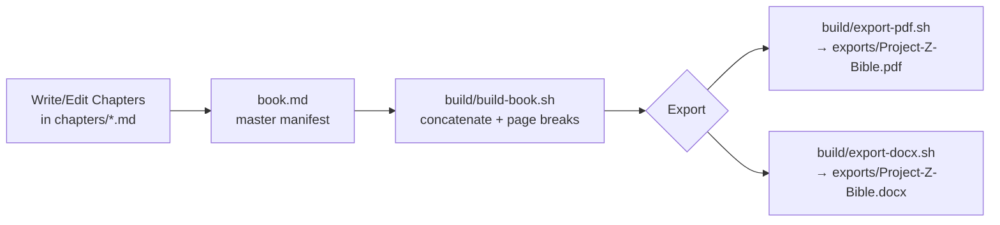

# Project-Z Bible

**The complete build handbook for a 2005–2006 Nissan 350Z (Z33) automatic project car.**

Theme: **Lavender & Charcoal** · Style: premium motorsports handbook — clean, modern, technical, blueprint-inspired.

Budget envelope: **$20,000 – $28,000** · Final goal: **a reliable 500 hp street car.**

---

## What this is

Project-Z Bible is a self-contained publishing project. Every chapter is plain Markdown,
every diagram is Mermaid, and the whole book can be exported to a single branded PDF or
DOCX with the scripts in `build/`. It is meant to be *used* — printed, marked up, hung in
the garage, and updated every time a part is bought or a job is done.



## Folder structure

```
Project-Z-Bible/
├── README.md              This file
├── book.md                Master manifest — defines chapter order for exports
├── chapters/              All 21 chapters, numbered 00–20, plain Markdown
├── assets/                Logo, cover art, placeholder images (SVG)
├── diagrams/              Standalone Mermaid (.mmd) source diagrams
├── templates/             Theme/style files + reusable log entry templates
├── exports/               Build output lands here (PDF, DOCX, HTML) — gitignored contents
└── build/                 Build & export scripts
```

## Chapter map

| # | File | Chapter |
|---|------|---------|
| 00 | `chapters/00-cover.md` | Cover page |
| 01 | `chapters/01-toc.md` | Clickable table of contents |
| 02 | `chapters/02-project-vision.md` | Project vision |
| 03 | `chapters/03-beginner-car-guide.md` | Beginner car guide |
| 04 | `chapters/04-350z-buyers-guide.md` | 350Z buyer's guide |
| 05 | `chapters/05-inspection-checklist.md` | Inspection checklist |
| 06 | `chapters/06-maintenance-guide.md` | Maintenance guide |
| 07 | `chapters/07-phase1-build-plan.md` | Phase 1 build plan |
| 08 | `chapters/08-phase2-500hp-plan.md` | Phase 2 — 500 hp plan |
| 09 | `chapters/09-budget-tracker.md` | Budget tracker |
| 10 | `chapters/10-parts-list.md` | Parts list |
| 11 | `chapters/11-wheel-tire-guide.md` | Wheel & tire guide |
| 12 | `chapters/12-suspension-guide.md` | Suspension guide |
| 13 | `chapters/13-brake-guide.md` | Brake guide |
| 14 | `chapters/14-bodykit-wrap-guide.md` | Body kit & wrap guide |
| 15 | `chapters/15-turbo-planning-guide.md` | Turbo planning guide |
| 16 | `chapters/16-driving-rules.md` | Driving rules |
| 17 | `chapters/17-maintenance-log.md` | Maintenance log |
| 18 | `chapters/18-modification-log.md` | Modification log |
| 19 | `chapters/19-expense-tracker.md` | Expense tracker |
| 20 | `chapters/20-glossary.md` | Glossary |

`book.md` lists these in build order — edit that file if you reorder, add, or split chapters.

## Theme

Colors and type live in `templates/theme.yaml` (single source of truth) and are applied via
`templates/style.css` (HTML/PDF) — see [`templates/README.md`](templates/README.md) for the
full palette.

| Swatch | Name | Hex | Use |
|---|---|---|---|
| 🟪 | Lavender | `#B9A6E0` | Headings, links, accents |
| 🟪 | Deep Lavender | `#6C4F9C` | Section rules, callout borders |
| ⬛ | Charcoal | `#1E1F24` | Body background (dark mode), cover |
| ⬛ | Soft Charcoal | `#2B2D33` | Cards, tables, code blocks |
| ⬜ | Fog | `#EDEAF5` | Body text on dark, light backgrounds |

## Building & exporting the book

### Requirements

- [Pandoc](https://pandoc.org) (required for both exports)
- A LaTeX engine for PDF — `xelatex` recommended (install via TeX Live / MacTeX / `texlive-xetex`)
- [Mermaid CLI](https://github.com/mermaid-js/mermaid-cli) (`npm install -g @mermaid-js/mermaid-cli`) — optional, only needed to pre-render diagrams to images for PDF/DOCX. Without it, diagrams still render fine in the Markdown/GitHub view and in any HTML export.

### One-time setup check

```bash
cd Project-Z-Bible
build/build-book.sh --check   # reports which tools are available
```

### Build the combined manuscript

```bash
build/build-book.sh
# → build/Project-Z-Bible.full.md  (all chapters concatenated, in book.md order)
```

### Export to PDF

```bash
build/export-pdf.sh
# → exports/Project-Z-Bible.pdf
```

### Export to DOCX

```bash
build/export-docx.sh
# → exports/Project-Z-Bible.docx
```

### Render Mermaid diagrams to images (optional, improves PDF/DOCX fidelity)

```bash
build/render-diagrams.sh
# → assets/images/diagrams/*.svg
```

Run this before `export-pdf.sh` / `export-docx.sh` if you have `mmdc` installed — the export
scripts will automatically prefer rendered images over raw Mermaid code blocks when they
exist.

## Editing the book

- Add or reorder chapters by editing the list in `book.md`.
- Keep one `#` top-level heading per chapter file — that heading becomes the chapter title
  in the table of contents and in pandoc's auto-generated bookmarks.
- Use the entry templates in `templates/` for consistent maintenance/modification/expense
  log rows.
- Placeholder art lives in `assets/images/` and `assets/logo/` as SVGs — swap them for real
  photos/renders as the build progresses; keep the same filenames so chapters don't break.

## Status

This is v1 — fully drafted starter content in every chapter, ready to build and print. Logs
and trackers ship with realistic example rows; clear them out (keep the header rows) when
you start your own build.
