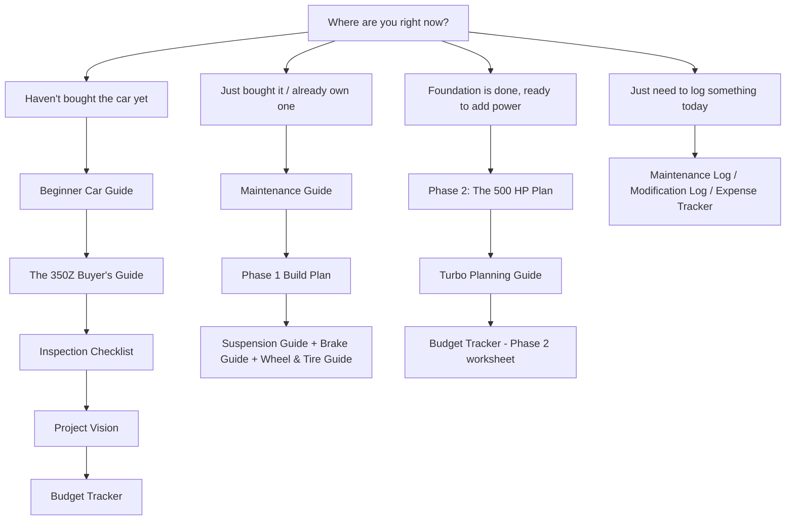

# Table of Contents

> **📌 Note:** This is a manual, GitHub-friendly table of contents for browsing the raw
> Markdown chapters. When you export to PDF or DOCX (`build/export-pdf.sh` /
> `build/export-docx.sh`), Pandoc also generates a fully clickable, bookmarked table of
> contents automatically from the chapter headings — that one is authoritative for the
> printed/exported book.

## Full chapter list

| # | Chapter | One-line summary |
|---|---|---|
| 1 | [Project Vision](#project-vision) | The goal, the non-negotiables, and the build arc in one picture |
| 2 | [Beginner Car Guide](#beginner-car-guide) | Vocabulary, systems, tools, and safety basics — start here if any of this is new |
| 3 | [The 350Z Buyer's Guide](#the-350z-buyers-guide) | Which trim, what breaks, what to pay |
| 4 | [Inspection Checklist](#inspection-checklist) | Print-and-carry checklist for the day you look at (or buy) the car |
| 5 | [Maintenance Guide](#maintenance-guide) | Fluids, intervals, torque specs — keeping the car healthy |
| 6 | [Phase 1 Build Plan](#phase-1-build-plan) | The foundation: brakes, suspension, wheels, transmission prep |
| 7 | [Phase 2: The 500 HP Plan](#phase-2-the-500-hp-plan) | Turbo, fuel, transmission build, tuning — in the right order |
| 8 | [Budget Tracker](#budget-tracker) | Live worksheet — plan vs. actual, by category |
| 9 | [Parts List](#parts-list) | Category-level shopping list for both phases |
| 10 | [Wheel & Tire Guide](#wheel--tire-guide) | Sizing for the power target, not just for looks |
| 11 | [Suspension Guide](#suspension-guide) | Coilovers, bushings, alignment, corner balance |
| 12 | [Brake Guide](#brake-guide) | Stopping power sized ahead of the power plan |
| 13 | [Body Kit & Wrap Guide](#body-kit--wrap-guide) | Optional cosmetics, theme application |
| 14 | [Turbo Planning Guide](#turbo-planning-guide) | Why single-turbo, moderate boost — and how it's sized |
| 15 | [Driving Rules](#driving-rules) | The personal ground rules this build assumes you'll drive by |
| 16 | [Maintenance Log](#maintenance-log) | Fill-in log of routine service |
| 17 | [Modification Log](#modification-log) | Fill-in log of every part that goes on the car |
| 18 | [Expense Tracker](#expense-tracker) | Fill-in log of every dollar spent |
| 19 | [Glossary](#glossary) | Every term in this book, defined in plain English |

## Suggested reading paths

Nobody needs to read this book in a straight line front-to-back on day one. Pick the path
that matches where you are right now:

| If you are... | Read these chapters, in order |
|---|---|
| Still shopping for a car | Beginner Car Guide → Buyer's Guide → Inspection Checklist → Project Vision → Budget Tracker |
| A brand-new owner, car just arrived | Maintenance Guide → Phase 1 Build Plan → Suspension/Brake/Wheel & Tire Guides |
| Done with Phase 1, ready for power | Phase 2 Plan → Turbo Planning Guide → Budget Tracker (Phase 2 worksheet) → Parts List |
| Just here to log something | Jump straight to Maintenance Log, Modification Log, or Expense Tracker |
| Confused by a term | Glossary — it's alphabetical and cross-linked back to the chapter that uses it |

## How to read this book

| Symbol | Meaning |
|---|---|
| 💡 Tip | A trick that saves time or money |
| ⚠️ Caution | Get this wrong and it costs you a part or a weekend |
| 🛑 Critical | Safety-relevant — do not skip |
| 📌 Note | Context or a reference back to another chapter |
| ✅ Checklist | Track it, don't just read it |

Every log/tracker chapter (Maintenance Log, Modification Log, Expense Tracker, Budget
Tracker) ships with sample rows so the format is obvious. Clear the sample data — keep the
header row — before you start logging your own build.

## Frequently asked questions about using this book

> **Q: I've never done anything mechanical to a car before. Is this book still for me?**
> Yes — that's who it was written for first. The [Beginner Car Guide](#beginner-car-guide)
> assumes zero prior knowledge and defines every term as it's introduced. Where a job is
> genuinely risky to attempt without experience (tuning, turbo installation, transmission
> building), the book says so explicitly and tells you what a competent shop should be doing
> instead, so you can evaluate their work even if you're not the one doing it.

> **Q: Do I have to follow the two-phase plan exactly?**
> No. The order (foundation before power) is the one non-negotiable, because it's a safety
> and reliability issue, not a preference. Within each phase, the order of individual jobs
> can flex around your budget and what parts are available — the book flags anywhere the
> order genuinely matters versus where it's just a sensible default.

> **Q: What if my car is a manual, not an automatic?**
> Most of this book (buyer's guide, inspection, suspension, brakes, wheels/tires, turbo
> planning, driving rules) applies equally. The parts that are automatic-specific are called
> out clearly — mainly the transmission sections of [Phase 2](#phase-2-the-500-hp-plan) and
> the automatic-specific due diligence in the [Buyer's Guide](#the-350z-buyers-guide). A
> manual car skips the transmission-build decision entirely and can generally support higher
> power on stock hard parts.

> **Q: Something in here contradicts what my mechanic/forum/friend told me. Now what?**
> This book gives you a solid, conservative default and explains its reasoning so you can
> evaluate other advice against it — it isn't the only correct way to build this car. If a
> trusted, experienced source disagrees with something here, ask them *why*, compare it to
> the reasoning given in this book, and make an informed call. Write down what you decided
> and why in the relevant log chapter so future-you remembers the reasoning too.
