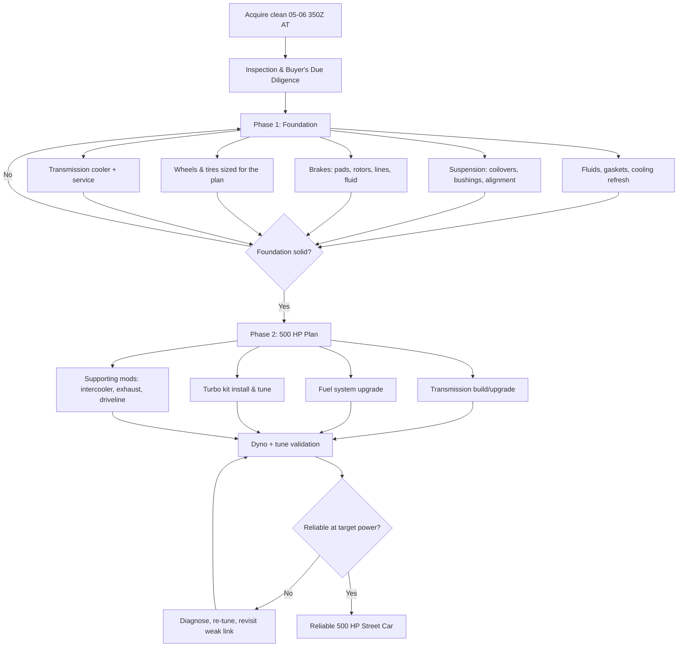

# Project Vision

## The pitch

A 2005–2006 Nissan 350Z, bought as an automatic, built in two deliberate phases into a
**reliable 500 hp street car** — not a trailer queen, not a track-only build, not a
one-weekend Facebook Marketplace flip. A car you can drive to work on Friday and to the
drag strip or a canyon run on Saturday, on a budget of **$20,000–$28,000** all-in
(purchase price excluded, unless noted otherwise in the Budget Tracker).

> **📌 Note:** Automatic 350Z. This is the single biggest decision-shaping fact in this
> whole book. The stock 5-speed automatic (JATCO RE5R05A) behind a 300 hp VQ35DE is not
> engineered for 500 hp. Every phase, every part choice, and every checklist in this book
> assumes the transmission is a first-class citizen of the build, not an afterthought.

## For readers who are brand new to this: what does "reliable 500 hp" actually mean?

If you've never built a car before, the phrase "500 hp street car" can sound like a single
purchase — buy a turbo kit, bolt it on, done. It isn't. It's the sum of dozens of small,
correct decisions across the whole car, in the right order. Here's the plain-English version
of what has to be true at the same time for the number "500 hp" to mean something you can
actually use, safely, every day:

| This has to be true... | ...or else | Covered in |
|---|---|---|
| The engine can safely take in enough air/fuel to make 500 hp | Lean-out, detonation, blown engine | [Turbo Planning Guide](#turbo-planning-guide) |
| The transmission can handle the torque without slipping or overheating | Burned clutches, no-forward-gear failure, stranded car | [Phase 2: The 500 HP Plan](#phase-2-the-500-hp-plan) |
| The tires can put that power to the road | Wheelspin, no traction, wasted power | [Wheel & Tire Guide](#wheel--tire-guide) |
| The suspension keeps the tires planted through a turn, not just in a straight line | Twitchy, unpredictable handling at speed | [Suspension Guide](#suspension-guide) |
| The brakes can stop a heavier-feeling, faster car repeatedly | Brake fade, longer stopping distances, an accident | [Brake Guide](#brake-guide) |
| The tune is verified with real data, not guessed | Engine damage from an unsafe tune | [Turbo Planning Guide](#turbo-planning-guide), [Phase 2](#phase-2-the-500-hp-plan) |
| Every one of the above still works after 500 miles, not just on the dyno | A "500 hp car" that's actually a trailer queen | [Definition of Done](#definition-of-done) below |

That's the whole book, compressed into one table. Everything from here is the detail behind
each row.

## Why this car

| Reason | Detail |
|---|---|
| Chassis | Front-mid-engine, RWD, 50/50-ish weight distribution — a genuinely good chassis under the badge |
| Engine | VQ35DE Rev-Up (2005–2006), naturally aspirated 300 hp, iron-sleeved block, known-good foundation for boost |
| Parts ecosystem | 20+ years of aftermarket support — turbo kits, suspension, brakes, body parts all exist off the shelf |
| Price point | Depreciated enough to buy clean for a fraction of new-car money, leaving budget for the build |
| Automatic angle | Underserved niche — most 350Z build content assumes manual; this book treats the automatic build path as first-class |

### Why not something else? Common alternatives, and why this book doesn't recommend them here

> **📌 Note:** These are reasonable builds too — they're just not *this* book's plan. Good to
> understand the trade-off so you know why the 350Z automatic path was chosen deliberately,
> not by default.

| Alternative | Why someone might choose it | Why this book doesn't |
|---|---|---|
| Manual-swap the 350Z first | Removes the transmission problem entirely | Adds cost and labor outside this book's budget envelope before any power is added; the automatic path is proven viable at 500 hp with the right transmission build |
| LS-swap the 350Z | Cheap, huge aftermarket, easy big power | Changes the car's character and this book's whole point (getting real power *from the factory drivetrain path*); also a much bigger, messier job for a first build |
| Buy a car that's already built | Skip the whole process | You inherit someone else's decisions, parts choices, and maintenance history — often more expensive in the long run and much harder to verify (see [Buyer's Guide](#the-350z-buyers-guide) red flags on pre-modified cars) |
| Stay naturally aspirated | Simpler, cheaper, still fun | Doesn't meet the "500 hp" goal — this is a fine build too, just a different book |

## Who this build is for — and who it isn't

> **✅ Honest self-check before you commit**
> - [ ] I can allocate $20,000–$28,000 to the build itself, separate from buying the car
> - [ ] I have (or am willing to pay for) access to a shop capable of transmission builds and
>   professional ECU tuning — this book explicitly does not treat those as DIY jobs
> - [ ] I want a car I drive regularly, not one that sits under a cover between shows
> - [ ] I'm willing to spend Phase 1 (see below) on parts that don't add a single horsepower,
>   because the plan requires it
> - [ ] I'm comfortable documenting spend and work as I go, not just "winging it"
>
> If any of these are a hard no, this specific book's plan may not fit — but the individual
> chapters (buyer's guide, maintenance, suspension, brakes) are still useful for any 350Z
> owner regardless of power goals.

## Non-negotiables

> **🛑 Critical:** These are the rules the whole plan is built around. If a part, a shop, or
> a shortcut violates one of these, it doesn't go on the car.

1. **Reliability over peak number.** 500 hp that survives a season beats 550 hp that
   grenades a transmission in month two.
2. **Street-driven first.** Daily-drivable manners: idle quality, AC, working stereo,
   tolerable ride height, insurance-legal exhaust, and a car that starts every time.
3. **Budgeted, not open-ended.** Every purchase gets logged in the
   [Budget Tracker](#budget-tracker) and [Expense Tracker](#expense-tracker) against the
   $20K–$28K envelope, split roughly 60/40 between Phase 1 (foundation) and Phase 2 (power).
4. **Phase discipline.** Don't buy turbo parts before the suspension, brakes, and
   transmission foundation are sorted — see [Phase 1](#phase-1-build-plan) and
   [Phase 2](#phase-2-the-500-hp-plan).
5. **Documented.** Every job goes in the [Maintenance Log](#maintenance-log) or
   [Modification Log](#modification-log). If it isn't written down, it didn't happen —
   and the next owner (or you, in three years) will thank you.

## The build arc

## How long does this actually take?

> **📌 Note for first-timers:** New builders consistently underestimate calendar time, not
> effort. Parts backorders, shop scheduling, and "let's drive it a bit before the next step"
> settling periods all add real weeks. Budget your patience the same way you budget money.

| Stage | Typical calendar time (part-time / evenings & weekends) | Typical calendar time (car is off the road, dedicated) |
|---|---|---|
| Buying + inspection | 2–6 weeks of searching | Same |
| Phase 1 (foundation) | 2–4 months | 3–6 weeks |
| Settling / driving on the new foundation | 2–4 weeks (recommended, not optional) | Same |
| Phase 2 (power) | 2–4 months | 4–8 weeks |
| Tuning + validation | 2–4 weeks, plus a follow-up session 500–1,000 miles later | Same |
| **Total, start to "done"** | **6–12 months** | **3–5 months** |

## Target power budget

| Path | Realistic power target | Transmission demand | Relative cost |
|---|---|---|---|
| N/A bolt-ons only | 300–320 hp | Stock-safe | $ |
| Single-turbo, low boost (6–8 psi) | 400–450 hp | Needs shift kit + cooler minimum | $$ |
| Single-turbo, moderate boost (8–12 psi) | 480–550 hp | Needs built valve body/converter or manual swap | $$$ |
| Twin-turbo, factory-style layout | 450–600+ hp | Same transmission demands as single-turbo at this power | $$$$ |

**This book targets the single-turbo, moderate-boost path** — the most cost-efficient route
to a genuine, repeatable 500 hp at the wheels while staying inside budget. See the
[Turbo Planning Guide](#turbo-planning-guide) and [Phase 2](#phase-2-the-500-hp-plan) for
the full reasoning.

> **💡 Tip for beginners: crank hp vs. wheel hp.** You'll see both numbers thrown around.
> "Crank hp" is measured (or rated) at the engine before anything robs power from it. "Wheel
> hp" (whp) is measured on a dyno at the wheels, after the transmission and driveline have
> already taken their cut (typically 15–20% loss on an automatic RWD car). This book's "500
> hp" target means **500 whp, measured on a dyno** — the harder, more honest number to hit.
> Be suspicious of any build that only quotes crank hp estimates with no dyno sheet.

## What could realistically go wrong (and where this book addresses it)

| Risk | Likelihood if plan is followed | Where it's mitigated |
|---|---|---|
| Transmission failure under boost | Low, if built per plan; high if skipped | [Phase 2](#phase-2-the-500-hp-plan) transmission section |
| Lean-out / engine damage from undersized fuel system | Low, if sized per plan; high if guessed | [Turbo Planning Guide](#turbo-planning-guide) fuel sizing |
| Budget overrun | Medium — most common failure mode in real builds | [Budget Tracker](#budget-tracker) discipline + contingency |
| Buying a car with hidden problems | Medium without due diligence | [Buyer's Guide](#the-350z-buyers-guide), [Inspection Checklist](#inspection-checklist) |
| Losing track of what's actually on the car | Medium over a multi-month build | [Modification Log](#modification-log) |
| Car that's fast but unpleasant/unsafe to drive daily | Medium if power is prioritized over the rest | Non-negotiable #2 above, [Driving Rules](#driving-rules) |

## Definition of done

> **✅ Checklist — this build is "done" (v1) when:**
> - [ ] Car makes a dyno-verified 500 whp (or crank-equivalent, documented in the tune sheet)
> - [ ] Car has done at least one 500-mile street stretch with no limp mode, no fluid leaks,
>   no check-engine lights
> - [ ] Transmission temps stay under 200°F in normal street driving with the upgraded cooler
> - [ ] Alignment, corner weights, and brake bias are logged and within spec
> - [ ] Every part on the car is logged in the [Modification Log](#modification-log) with
>   date, part number, and cost
> - [ ] Total spend is reconciled against the [Budget Tracker](#budget-tracker)

## Frequently asked questions

> **Q: Can I do this build faster by skipping Phase 1?**
> You can, but the book doesn't recommend it. Phase 1 items (brakes, suspension,
> transmission prep) aren't "nice to haves" — they're what makes Phase 2's power safe to use.
> Skipping ahead usually means paying for the same work twice: once rushed, once done right.

> **Q: What if my budget is closer to $15,000 or $35,000?**
> The plan's structure (foundation before power, transmission-first in Phase 2, documented
> spend) holds at either end. Below $20K, expect to stretch the timeline and shop harder for
> parts/labor deals rather than cut the transmission or brake budget. Above $28K, the honest
> upgrade is a nicer transmission build, better tires, or a second dyno session — not
> skipping straight to bigger turbo.

> **Q: Do I need to be mechanically skilled to follow this book?**
> No — you need to be willing to learn the vocabulary (see the
> [Beginner Car Guide](#beginner-car-guide)) and to know which jobs are genuinely safe to DIY
> versus which need a professional (each chapter marks this explicitly). Plenty of successful
> builders on this exact plan do zero wrenching themselves and instead use this book to
> evaluate shop quotes and catch mistakes before they're expensive.
