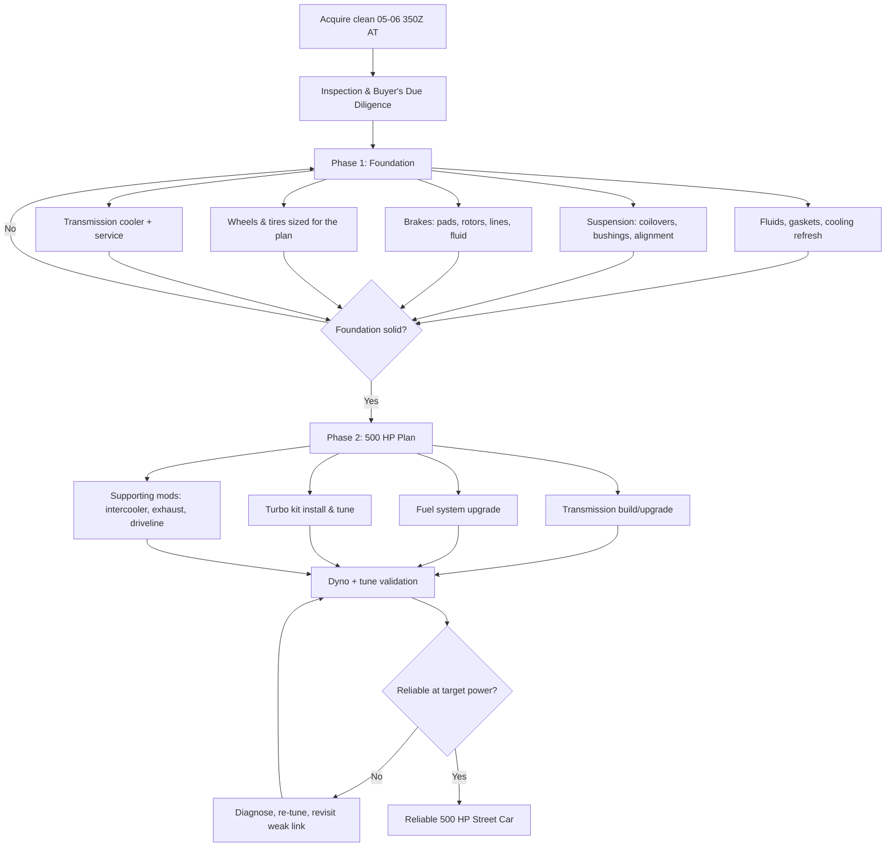

# Project Vision

## The pitch

A 2005–2006 Nissan 350Z, bought as an automatic, built in two deliberate phases into a
**reliable 500 hp street car** — not a trailer queen, not a track-only build, not a
one-weekend Facebook Marketplace flip. A car you can drive to work on Friday and to the
drag strip or a canyon run on Saturday, on a budget of **$20,000–$28,000** all-in
(purchase price excluded, unless noted otherwise in the Budget Tracker).

> **📌 Note:** Automatic 350Z. This is the single biggest decision-shaping fact in this
> whole book. The stock 5-speed automatic (JATCO RE5R05A) behind a 300 hp VQ35DE is not
> engineered for 500 hp. Every phase, every part choice, and every checklist in this book
> assumes the transmission is a first-class citizen of the build, not an afterthought.

## Why this car

| Reason | Detail |
|---|---|
| Chassis | Front-mid-engine, RWD, 50/50-ish weight distribution — a genuinely good chassis under the badge |
| Engine | VQ35DE Rev-Up (2005–2006), naturally aspirated 300 hp, iron-sleeved block, known-good foundation for boost |
| Parts ecosystem | 20+ years of aftermarket support — turbo kits, suspension, brakes, body parts all exist off the shelf |
| Price point | Depreciated enough to buy clean for a fraction of new-car money, leaving budget for the build |
| Automatic angle | Underserved niche — most 350Z build content assumes manual; this book treats the automatic build path as first-class |

## Non-negotiables

> **🛑 Critical:** These are the rules the whole plan is built around. If a part, a shop, or
> a shortcut violates one of these, it doesn't go on the car.

1. **Reliability over peak number.** 500 hp that survives a season beats 550 hp that
   grenades a transmission in month two.
2. **Street-driven first.** Daily-drivable manners: idle quality, AC, working stereo,
   tolerable ride height, insurance-legal exhaust, and a car that starts every time.
3. **Budgeted, not open-ended.** Every purchase gets logged in the
   [Budget Tracker](#budget-tracker) and [Expense Tracker](#expense-tracker) against the
   $20K–$28K envelope, split roughly 60/40 between Phase 1 (foundation) and Phase 2 (power).
4. **Phase discipline.** Don't buy turbo parts before the suspension, brakes, and
   transmission foundation are sorted — see [Phase 1](#phase-1-build-plan) and
   [Phase 2](#phase-2-the-500-hp-plan).
5. **Documented.** Every job goes in the [Maintenance Log](#maintenance-log) or
   [Modification Log](#modification-log). If it isn't written down, it didn't happen —
   and the next owner (or you, in three years) will thank you.

## The build arc

## Target power budget

| Path | Realistic power target | Transmission demand | Relative cost |
|---|---|---|---|
| N/A bolt-ons only | 300–320 hp | Stock-safe | $ |
| Single-turbo, low boost (6–8 psi) | 400–450 hp | Needs shift kit + cooler minimum | $$ |
| Single-turbo, moderate boost (8–12 psi) | 480–550 hp | Needs built valve body/converter or manual swap | $$$ |
| Twin-turbo, factory-style layout | 450–600+ hp | Same transmission demands as single-turbo at this power | $$$$ |

**This book targets the single-turbo, moderate-boost path** — the most cost-efficient route
to a genuine, repeatable 500 hp at the wheels while staying inside budget. See the
[Turbo Planning Guide](#turbo-planning-guide) and [Phase 2](#phase-2-the-500-hp-plan) for
the full reasoning.

## Definition of done

> **✅ Checklist — this build is "done" (v1) when:**
> - [ ] Car makes a dyno-verified 500 whp (or crank-equivalent, documented in the tune sheet)
> - [ ] Car has done at least one 500-mile street stretch with no limp mode, no fluid leaks,
>   no check-engine lights
> - [ ] Transmission temps stay under 200°F in normal street driving with the upgraded cooler
> - [ ] Alignment, corner weights, and brake bias are logged and within spec
> - [ ] Every part on the car is logged in the [Modification Log](#modification-log) with
>   date, part number, and cost
> - [ ] Total spend is reconciled against the [Budget Tracker](#budget-tracker)
