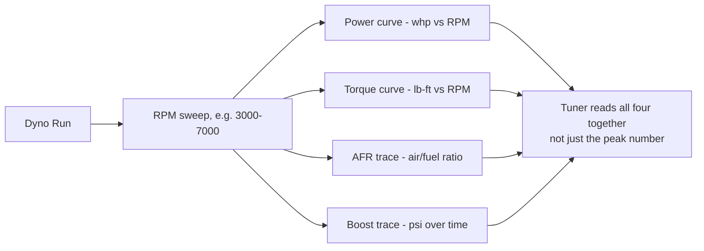

# Beginner Car Guide

> **📌 Note:** If you've built cars before, skim this chapter for the 350Z-specific callouts
> and move on to the [Buyer's Guide](#the-350z-buyers-guide). If this is your first project
> car, read it end to end first — it's the vocabulary the rest of the book assumes.

## How to read this book if you're new to this

Every chapter follows the same shape: **what it is → why it matters → what to actually do →
how to check your work.** You don't need to memorize anything — you need to know where to
look it up again in six months.

## The systems on your car, in plain English

| System | What it does | Why you'll care during this build |
|---|---|---|
| Engine (VQ35DE) | Burns fuel + air, makes rotational power | Everything downstream depends on how much air/fuel it can flow |
| Transmission (5-speed auto) | Converts engine RPM into usable road speed via gear ratios | **The weak link in this specific build** — see every chapter after this one |
| Cooling system | Keeps engine and transmission from overheating | Boost + hard driving = 2–3x the heat load of stock |
| Suspension | Springs, shocks, arms, bushings — controls how the tire meets the road | Determines whether 500 hp is usable or just wheelspin |
| Brakes | Converts kinetic energy into heat via friction | More power without more brake = a car that goes faster than it can stop |
| Fuel system | Pump, lines, injectors, regulator — delivers fuel to the engine | Must scale with power or you'll lean out and melt a piston |
| ECU / tune | The computer controlling ignition timing, fuel, boost | The single most important safety system once you add power |
| Driveline | Driveshaft, differential, axles — gets power to the rear wheels | Often overlooked; can become the new weak link after the transmission is addressed |

## Core vocabulary

| Term | Plain-English definition |
|---|---|
| NA / N/A | Naturally aspirated — no turbo or supercharger, engine breathes on atmospheric pressure alone |
| Boost | Positive pressure in the intake, above atmospheric — what a turbo creates |
| WHP / whp | Wheel horsepower — power measured at the wheels on a dyno, after drivetrain losses |
| Crank HP | Power measured (or rated) at the engine's crankshaft, before the transmission/driveline eat some of it |
| Tune / Map | The set of instructions telling the ECU how much fuel and timing to use at any given RPM/load |
| Torque converter | The fluid coupling in an automatic transmission that connects the engine to the transmission |
| Shift kit | A modification that makes automatic transmission shifts firmer/faster and more consistent |
| Corner balance | Adjusting suspension so each wheel carries the intended share of the car's weight |
| Camber / Caster / Toe | The three alignment angles that determine how a tire sits and tracks on the road |
| Detonation / Knock | Uncontrolled fuel ignition inside the cylinder — the #1 killer of boosted engines run too lean or too much timing |
| Log (data log) | A recording of sensor values (boost, AFR, knock, trans temp) over time, used to diagnose and tune |

## Tools every owner of this project should have

> **✅ Checklist — minimum garage kit**
> - [ ] Metric socket set (10mm–19mm covers 90% of this car)
> - [ ] Torque wrench (both a click-type for mid-range and a beam/small for lower-torque fasteners)
> - [ ] OBD-II scanner or laptop + consult software (for codes, live data, and post-tune logging)
> - [ ] Jack + jack stands rated for the car's weight (never work under a car on a jack alone)
> - [ ] Torque spec sheet for your exact fasteners (see [Maintenance Guide](#maintenance-guide))
> - [ ] Fluids: engine oil, transmission fluid (correct JATCO-spec ATF), brake fluid, coolant
> - [ ] Notebook or this book, printed — for the [Maintenance Log](#maintenance-log)

## Reading a dyno sheet (you'll see these constantly in Phase 2)

> **⚠️ Caution:** A dyno sheet with a big peak number and nothing else (no AFR trace, no
> knock/timing trace) tells you almost nothing about whether the tune is safe. Always ask
> for the full log, not just the headline horsepower.

## Safety basics before you touch anything

> **🛑 Critical**
> - Never work under a car supported only by a jack — always use rated jack stands.
> - Disconnect the battery before working on airbags, electrical, or fuel system components.
> - Relieve fuel system pressure before opening any fuel line (see [Maintenance Guide](#maintenance-guide)).
> - Let the exhaust, turbo, and brakes cool before working near them — these run well over
>   the temperature that causes serious burns.
> - Wheel chocks + parking brake + transmission in Park, every time, no exceptions.

## Where this book assumes you're starting

This handbook assumes:
1. You are buying (or already own) a 2005–2006 350Z with the 5-speed automatic transmission.
2. You want a car that's genuinely driven, not a static build.
3. You are working with a realistic budget and want every dollar to count — hence the
   [Budget Tracker](#budget-tracker) and [Expense Tracker](#expense-tracker).
4. You will use a professional shop for the jobs that carry outsized risk if done wrong
   (tuning, turbo install, transmission build) even if you're doing the rest yourself. This
   book tells you what "good" looks like from each of those shops, not how to replace them.
