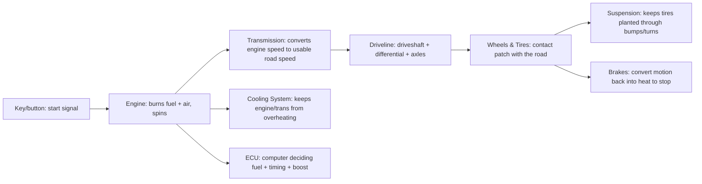
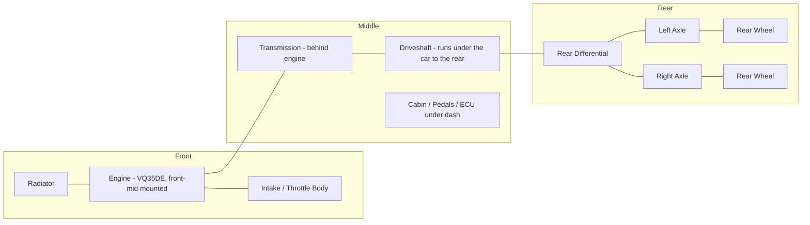
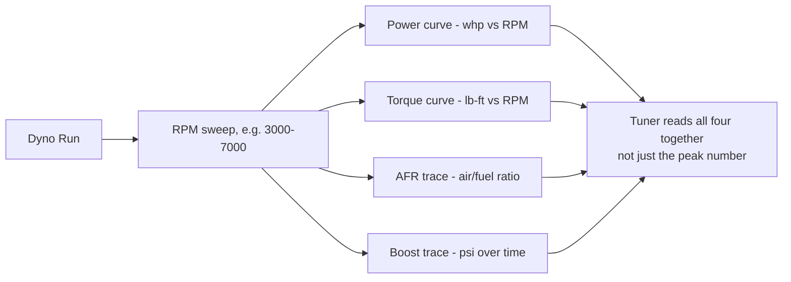

# Beginner Car Guide

> **📌 Note:** If you've built cars before, skim this chapter for the 350Z-specific callouts
> and move on to the [Buyer's Guide](#the-350z-buyers-guide). If this is your first project
> car, read it end to end first — it's the vocabulary the rest of the book assumes.

## How to read this book if you're new to this

Every chapter follows the same shape: **what it is → why it matters → what to actually do →
how to check your work.** You don't need to memorize anything — you need to know where to
look it up again in six months. If a word feels unfamiliar anywhere in this book, it's almost
certainly defined either right where it's used or in the [Glossary](#glossary).

## How a car actually works, in one picture

If you've never had this explained before, here's the whole car in one flow — everything
else in this book is detail hung off this skeleton.

Every chapter in this book is really about one or two boxes in that diagram: the
[Buyer's Guide](#the-350z-buyers-guide) and [Maintenance Guide](#maintenance-guide) keep all
of them healthy; [Phase 1](#phase-1-build-plan) upgrades suspension/brakes/wheels; [Phase 2](#phase-2-the-500-hp-plan)
upgrades the engine/transmission/ECU side.

## The systems on your car, in plain English

| System | What it does | Why you'll care during this build |
|---|---|---|
| Engine (VQ35DE) | Burns fuel + air, makes rotational power | Everything downstream depends on how much air/fuel it can flow |
| Transmission (5-speed auto) | Converts engine RPM into usable road speed via gear ratios | **The weak link in this specific build** — see every chapter after this one |
| Cooling system | Keeps engine and transmission from overheating | Boost + hard driving = 2–3x the heat load of stock |
| Suspension | Springs, shocks, arms, bushings — controls how the tire meets the road | Determines whether 500 hp is usable or just wheelspin |
| Brakes | Converts kinetic energy into heat via friction | More power without more brake = a car that goes faster than it can stop |
| Fuel system | Pump, lines, injectors, regulator — delivers fuel to the engine | Must scale with power or you'll lean out and melt a piston |
| ECU / tune | The computer controlling ignition timing, fuel, boost | The single most important safety system once you add power |
| Driveline | Driveshaft, differential, axles — gets power to the rear wheels | Often overlooked; can become the new weak link after the transmission is addressed |
| Electrical system | Battery, alternator, wiring, sensors | Everything above depends on clean, reliable power and signal — an old battery or corroded ground can masquerade as a much scarier problem |
| Exhaust | Routes spent gases out, moderates sound, matters for turbo flow | Undersized exhaust chokes a turbo build; see [Turbo Planning Guide](#turbo-planning-guide) |

## Anatomy of the 350Z, front to back

If you're not sure where things physically live on the car, this is the mental map the rest
of the book assumes:

The 350Z is a **front-mid-engine, rear-wheel-drive** car: the engine sits behind the front
axle line (not hanging out ahead of it like many front-drive cars), and power routes all the
way to the back of the car before it ever reaches the driven wheels. That long path — engine
→ transmission → driveshaft → differential → axles → wheels — is exactly why a transmission
or differential problem can feel like it's coming from "somewhere in the middle of the car"
and confuse a new owner trying to self-diagnose a noise.

## Core vocabulary

| Term | Plain-English definition |
|---|---|
| NA / N/A | Naturally aspirated — no turbo or supercharger, engine breathes on atmospheric pressure alone |
| Boost | Positive pressure in the intake, above atmospheric — what a turbo creates |
| WHP / whp | Wheel horsepower — power measured at the wheels on a dyno, after drivetrain losses |
| Crank HP | Power measured (or rated) at the engine's crankshaft, before the transmission/driveline eat some of it |
| Tune / Map | The set of instructions telling the ECU how much fuel and timing to use at any given RPM/load |
| Torque converter | The fluid coupling in an automatic transmission that connects the engine to the transmission |
| Shift kit | A modification that makes automatic transmission shifts firmer/faster and more consistent |
| Corner balance | Adjusting suspension so each wheel carries the intended share of the car's weight |
| Camber / Caster / Toe | The three alignment angles that determine how a tire sits and tracks on the road |
| Detonation / Knock | Uncontrolled fuel ignition inside the cylinder — the #1 killer of boosted engines run too lean or too much timing |
| Log (data log) | A recording of sensor values (boost, AFR, knock, trans temp) over time, used to diagnose and tune |
| RWD / FWD / AWD | Rear-/Front-/All-Wheel Drive — which wheels the engine actually powers |
| OEM | Original Equipment Manufacturer — the factory part, as opposed to an aftermarket replacement |
| Aftermarket | Any part made by a company other than the original car manufacturer |
| VIN | Vehicle Identification Number — the car's unique 17-character fingerprint, used to verify title/history/parts fitment |
| PPI | Pre-Purchase Inspection — a professional once-over before you buy, covered in the [Inspection Checklist](#inspection-checklist) |
| Fitment | Whether a part physically fits and clears everything around it, correctly |
| Torque (fastener) | How tight a bolt/nut is, measured in a unit like ft-lb — too loose fails, too tight can strip or snap |
| OBD-II | The standardized diagnostic port/protocol every car since the mid-90s uses for scan tools |

## Understanding basic hand tools (if you've genuinely never used any)

> **📌 Note:** Skip this section if you already know your way around a toolbox. It exists
> because "everyone assumes you already know this" is exactly how beginners get talked over.

| Tool | What it's for | Beginner tip |
|---|---|---|
| Socket wrench + sockets | Turning bolts/nuts of a specific size | Sockets are sized in mm (metric) on this car — a 10mm socket only fits a 10mm bolt head |
| Torque wrench | Tightening a fastener to an exact, specified amount | "Tight" isn't a spec — always torque to the number in the [Maintenance Guide](#maintenance-guide), not by feel |
| Jack | Lifts one point of the car off the ground | A jack lifts; it does not hold — never trust a jack alone to support the car's weight |
| Jack stands | Support the car's weight once lifted, at a fixed height | Always used in pairs (or more), placed on the car's rated lift points |
| OBD-II scanner | Reads the car's onboard computer for trouble codes and live data | A cheap $20 scanner reads basic codes; better ones show live sensor data useful for diagnosis |
| Torque spec sheet | Reference list of exact tightening values per fastener | Comes from the factory service manual — treat it as non-negotiable, not a suggestion |

## Tools every owner of this project should have

> **✅ Checklist — minimum garage kit**
> - [ ] Metric socket set (10mm–19mm covers 90% of this car)
> - [ ] Torque wrench (both a click-type for mid-range and a beam/small for lower-torque fasteners)
> - [ ] OBD-II scanner or laptop + consult software (for codes, live data, and post-tune logging)
> - [ ] Jack + jack stands rated for the car's weight (never work under a car on a jack alone)
> - [ ] Torque spec sheet for your exact fasteners (see [Maintenance Guide](#maintenance-guide))
> - [ ] Fluids: engine oil, transmission fluid (correct JATCO-spec ATF), brake fluid, coolant
> - [ ] Notebook or this book, printed — for the [Maintenance Log](#maintenance-log)
> - [ ] Wheel chocks (block the wheels you're *not* lifting, every time)
> - [ ] Nitrile gloves and safety glasses — cheap, and you'll actually use them if they're within reach

## How to safely lift the car (step by step)

> **✅ Checklist — every time, no exceptions**
> - [ ] 1. Park on level, solid ground (not gravel, not an incline)
> - [ ] 2. Set the parking brake and put the transmission in Park
> - [ ] 3. Chock the wheels that will stay on the ground
> - [ ] 4. Locate the car's factory-rated jack points (see your owner's manual — using the
>   wrong spot can dent the floor pan or, worse, let the car slip off the jack)
> - [ ] 5. Raise the jack until the wheel just leaves the ground
> - [ ] 6. Place a jack stand under a rated frame point near the jack point
> - [ ] 7. Slowly lower the car onto the stand until its full weight rests on the stand, not the jack
> - [ ] 8. Give the car a firm push/shake test before going underneath
> - [ ] 9. Never put any part of your body under a car supported only by a jack

## Understanding your dashboard warning lights

| Light | What it usually means | Urgency |
|---|---|---|
| Check Engine (amber engine outline) | A stored diagnostic code — could be minor (loose gas cap) or serious (misfire) | Scan it before assuming either way |
| Check Engine, flashing | An active misfire — driving on it can damage the catalytic converter | Stop driving hard immediately, get it scanned |
| Oil pressure / oil can | Dangerously low oil pressure | Stop the car safely and shut it off — do not keep driving |
| Temperature gauge in the red / coolant light | Engine overheating | Stop safely, let it cool, check coolant level once cool — do not open a hot radiator cap |
| Battery / charging light | The alternator isn't charging the battery properly | Get it checked soon — you may have limited driving time before the battery dies |
| ABS | A fault in the anti-lock brake system | Regular brakes still work, but ABS won't assist in a hard stop — get it checked |
| VDC / Slip | A fault in the stability control or a sensor feeding it | Common after a wheel speed sensor issue — see [Buyer's Guide](#the-350z-buyers-guide) known issues |
| Brake warning | Low brake fluid or parking brake engaged | Check parking brake first, then fluid level — see [Brake Guide](#brake-guide) |

> **🛑 Critical:** A flashing check-engine light or an oil pressure warning both mean stop
> driving and address it before continuing — these are "get off the road," not "get it looked
> at eventually," situations.

## How to check your own fluids (a first-timer's walkthrough)

> **✅ Checklist — takes about 10 minutes, do it monthly**
> - [ ] Park on level ground, engine off and cooled if checking coolant
> - [ ] **Engine oil:** locate the dipstick, pull it, wipe clean, reinsert fully, pull again —
>   read the level between the min/max marks; check the color (amber to dark brown is
>   normal, milky suggests coolant contamination — get that checked immediately)
> - [ ] **Coolant:** check the level in the translucent overflow/reservoir tank against its
>   min/max marks — never open a hot radiator cap
> - [ ] **Brake fluid:** check the level in the reservoir under the hood against its marks;
>   fluid should be clear to light amber, not dark brown
> - [ ] **Power steering fluid (if equipped separately):** check against its reservoir marks
> - [ ] **Washer fluid:** top off — cheap, easy, and you'll be glad you did on a road trip
> - [ ] **Tire pressure:** check cold (before driving) against the door jamb sticker spec, not
>   the number printed on the tire's sidewall (that's a maximum, not the recommended pressure)

## Reading a dyno sheet (you'll see these constantly in Phase 2)

> **⚠️ Caution:** A dyno sheet with a big peak number and nothing else (no AFR trace, no
> knock/timing trace) tells you almost nothing about whether the tune is safe. Always ask
> for the full log, not just the headline horsepower.

## Talking to a shop without getting talked over

> **💡 Tips for a first-timer walking into a shop**
> - Bring the relevant chapter of this book (printed or on your phone) — it's fine to
>   reference it, and a good shop won't mind
> - Ask for a written, itemized quote before work starts, not a verbal ballpark
> - Ask specifically "what parts, what brand, and what labor hours" rather than accepting a
>   single lump number
> - If a recommendation contradicts this book, ask them to explain why — a good shop can
>   explain their reasoning; a shop that gets defensive instead of explaining is a flag
> - For anything safety-critical (brakes, suspension, tuning, transmission), a slightly
>   higher price from a shop with verifiable experience on this exact platform is worth it

| Shop type | Good for | Not usually the right choice for |
|---|---|---|
| Dealer service department | Warranty work, factory recalls, routine maintenance on a stock car | Performance modifications, tuning — usually not their focus |
| General independent mechanic | Routine maintenance, brakes, general repairs | Turbo installs, ECU tuning — verify specific experience first |
| Performance/tuning shop | Turbo installs, ECU tuning, dyno sessions, transmission builds | Routine oil changes — often priced at a premium for basic work |
| Specialty transmission shop | Transmission builds/rebuilds specifically | General engine/suspension work |

## Safety basics before you touch anything

> **🛑 Critical**
> - Never work under a car supported only by a jack — always use rated jack stands.
> - Disconnect the battery before working on airbags, electrical, or fuel system components.
> - Relieve fuel system pressure before opening any fuel line (see [Maintenance Guide](#maintenance-guide)).
> - Let the exhaust, turbo, and brakes cool before working near them — these run well over
>   the temperature that causes serious burns.
> - Wheel chocks + parking brake + transmission in Park, every time, no exceptions.
> - Keep a fire extinguisher rated for fuel/electrical fires in the garage, not just in the car.
> - Work in a ventilated area — running an engine in a closed garage is a carbon monoxide risk.

## Common first-timer mistakes (and how this book helps you avoid them)

| Mistake | Why it happens | How this book helps |
|---|---|---|
| Buying the turbo kit before fixing the brakes | Power is the fun part | [Project Vision](#project-vision) non-negotiables, [Phase 1](#phase-1-build-plan) sequencing |
| Guessing at torque specs "by feel" | Not knowing a spec sheet exists | [Maintenance Guide](#maintenance-guide) torque table |
| Not tracking spend until it's already over budget | No system in place from day one | [Budget Tracker](#budget-tracker), [Expense Tracker](#expense-tracker) |
| Trusting a tune with no data log | Not knowing what a good tune sheet looks like | "Reading a dyno sheet," above |
| Forgetting what's actually been done to the car | No log kept | [Modification Log](#modification-log) |
| Using the wrong transmission fluid | Assuming "ATF is ATF" | [Maintenance Guide](#maintenance-guide) fluid specs |

## Your first 30 days with the car

> **✅ Checklist**
> - [ ] Week 1: full fluid check (see walkthrough above), full diagnostic scan, review any
>   open items from the [Inspection Checklist](#inspection-checklist)
> - [ ] Week 1: read [Project Vision](#project-vision) and [Maintenance Guide](#maintenance-guide) in full
> - [ ] Week 2: address any deferred maintenance found — don't start Phase 1 on top of an
>   unresolved issue
> - [ ] Week 2–3: open your [Budget Tracker](#budget-tracker) and [Modification Log](#modification-log),
>   even if they're still mostly empty
> - [ ] Week 3–4: get quotes for Phase 1 categories (brakes, suspension, wheels/tires) —
>   see [Parts List](#parts-list)
> - [ ] Ongoing: drive it. You should know how it sounds, idles, and shifts *before* you
>   modify it, so you can tell when something changes.

## Where this book assumes you're starting

This handbook assumes:
1. You are buying (or already own) a 2005–2006 350Z with the 5-speed automatic transmission.
2. You want a car that's genuinely driven, not a static build.
3. You are working with a realistic budget and want every dollar to count — hence the
   [Budget Tracker](#budget-tracker) and [Expense Tracker](#expense-tracker).
4. You will use a professional shop for the jobs that carry outsized risk if done wrong
   (tuning, turbo install, transmission build) even if you're doing the rest yourself. This
   book tells you what "good" looks like from each of those shops, not how to replace them.

## Frequently asked questions

> **Q: I don't know how to do any of this. Where do I actually start?**
> Start by reading, not by buying parts. Read this chapter, then
> [The 350Z Buyer's Guide](#the-350z-buyers-guide) and
> [Inspection Checklist](#inspection-checklist) before you buy a car, or
> [Maintenance Guide](#maintenance-guide) if you already own one. Knowledge is the cheapest
> part of this build and it's the part most people skip.

> **Q: How do I know if a noise/problem is serious?**
> As a rough rule: anything involving smoke, burning smells, fluid on the ground, a flashing
> warning light, or a change in braking/steering feel means stop and investigate before
> driving further. Anything else, note it in your [Maintenance Log](#maintenance-log) and
> get it looked at at the next opportunity.

> **Q: Is it okay to learn by making mistakes on this car?**
> On low-risk, reversible items (interior trim, non-structural cosmetic parts) — sure. On
> anything in the 🛑 Critical callouts throughout this book (brakes, fuel system, suspension
> fasteners, anything supporting the car's weight) — no. That's exactly the line between "DIY
> and learn" and "pay a professional," and this book tries to mark it clearly every time.
