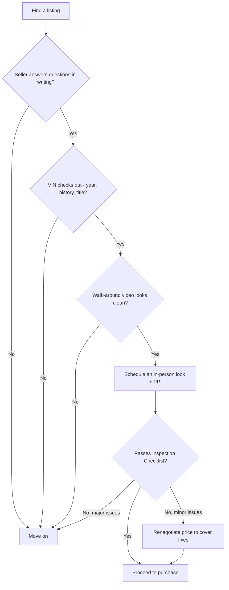

# The 350Z Buyer's Guide

> **📌 Note for first-time buyers:** Nothing in this chapter requires you to be a mechanic.
> It requires patience, a checklist (see the [Inspection Checklist](#inspection-checklist)),
> and a willingness to walk away from a car that fails it. That last part is the hardest and
> most important skill in this whole chapter.

## Which car, exactly

This book targets the **2005–2006 Nissan 350Z (Z33)**, automatic transmission, VQ35DE
"Rev-Up" engine (revised heads/intake, 300 hp / 260 lb-ft, redline raised to 7,000 RPM vs.
6,600 on 2003–2004 cars). Trims to know:

| Trim | What it adds | Relevance to this build |
|---|---|---|
| Base | Cloth seats, base wheels | Fine — most trim is cosmetic and gets replaced anyway |
| Enthusiast | Bose audio, upgraded wheels | Fine, nice to have |
| Touring | Leather, heated seats | Fine, adds weight, no functional downside |
| Grand Touring | Brembo brakes, 18" wheels, VDC | **Preferred if automatic** — factory Brembos are a real head start on the [Brake Guide](#brake-guide) plan |
| Track | Manual-only, Brembo brakes | N/A — this book is automatic-specific |

> **📌 Note:** A Grand Touring trim automatic with factory Brembo brakes saves real money
> against the Phase 1 brake budget — weight this in your purchase search.

## What "Rev-Up" actually means (and why the model year matters)

If you're new to this, "Rev-Up" sounds like marketing fluff — it isn't. Nissan revised the
VQ35DE's cylinder heads, intake, and redline starting partway through the 350Z's life. Here's
why that matters to you as a buyer, not just trivia:

| Model years | Engine variant | Peak power | Redline | Buyer relevance |
|---|---|---|---|---|
| 2003–2004 | VQ35DE (early) | 287 hp | 6,600 RPM | Outside this book's scope — different parts/tune baseline |
| 2005–2006 | VQ35DE "Rev-Up" | 300 hp | 7,000 RPM | **This book's target** — revised heads flow better, a stronger N/A starting point for boost |
| 2007+ | VQ35HR | 306–313 hp | 7,500 RPM | Different generation (different body, different chassis) — not a 2005–2006 Z33 |

> **⚠️ Caution:** Always confirm the model year against the VIN and door jamb sticker, not
> just the seller's word — a title clerical error or a rebuilt-title car can have mismatched
> paperwork. See the title checklist below.

## Decoding the VIN (so you're not taking anyone's word for anything)

Every 350Z has a 17-character Vehicle Identification Number stamped on the dash (visible
through the windshield, driver's side) and on a sticker inside the driver's door jamb. Before
you ever hand over money:

> **✅ Checklist**
> - [ ] VIN on the dash matches the VIN on the door jamb sticker
> - [ ] VIN on both matches the title/registration paperwork exactly (17 characters, no typos)
> - [ ] The 10th character decodes to the model year you're expecting (a free VIN decoder
>   confirms this in seconds — do this before you even go look at the car)
> - [ ] Run the VIN through a vehicle history service before you travel to see the car —
>   it's cheap insurance against wasting a trip on a salvage-title car the ad didn't mention

## Where to look, and how to shop remotely first

> **💡 Tips for narrowing the search before you drive anywhere**
> - Ask for a recent walk-around video, not just posed photos — sellers rarely film obvious
>   problems on purpose, and casual video shows things staged photos hide
> - Ask direct questions in writing (text/email) so you have a record: "Any accidents? Any
>   modifications? Why are you selling? Any warning lights, ever?"
> - Cross-check the odometer reading in photos against the mileage stated in the ad
> - A seller who won't answer basic questions in writing, or gets cagey about an inspection,
>   is telling you something — believe them

## Known weak points to check before you buy

| Area | Issue | How to check |
|---|---|---|
| VQ35DE engine | Timing chain guides/tensioners wear, can rattle on cold start | Cold start, listen for 1–2 seconds of chain rattle; persistent rattle = budget for guides |
| VQ35DE engine | Oil consumption in higher-mile examples | Check oil level/color at purchase; ask for service records; budget an oil consumption test over 1,000 miles |
| Radiator / cooling | Plastic end tanks crack with age | Look for coolant staining at radiator seams, check coolant level and condition |
| 5-speed automatic (RE5R05A) | Can be harsh-shifting or slip when neglected; fluid is often never serviced | Check trans fluid color/smell (should be red, not brown/burnt); look for service records |
| Rear differential | Whine or clunk on deceleration, especially with worn viscous LSD | Listen for whine at speed, clunk on throttle on/off transitions |
| Hatch struts / hatch electronics | Weak struts, occasional window regulator failures | Check hatch holds itself open; test all windows |
| Front lower control arm bushings | Wear with age, cause clunks and vague steering | Push/pull test on jack stands, listen for clunks over bumps |
| VDC / ABS sensors | Wheel speed sensor failures trigger VDC/ABS/SLIP lights | Scan for codes, verify all dash warning lights clear after startup |
| Interior | Dash/trim rattles, worn seat bolsters | Drive test over rough road, listen for rattles |
| HVAC | Blend door actuator failures, weak AC on higher-mile cars | Run AC on max for 10+ minutes, feel for consistent cold air |

## For beginners: what each weak point actually costs to fix

Knowing a weak point exists is one thing — knowing whether it's a $50 fix or a $2,000 one is
what actually changes your offer. Rough, illustrative ranges (verify locally):

| Issue | Rough cost to address | Deal-breaker, or just a negotiating point? |
|---|---|---|
| Timing chain rattle (guides/tensioner) | Moderate — meaningful labor to access | Negotiating point if mild; deal-breaker if severe/persistent |
| Neglected transmission fluid | Low — a service, if caught early | Negotiating point, do it immediately either way |
| Cracked radiator end tank | Low-moderate | Negotiating point |
| Worn front control arm bushings | Low-moderate | Negotiating point, already in this book's Phase 1 plan anyway |
| Failing VDC/ABS wheel speed sensor | Low | Negotiating point |
| Weak AC (actuator) | Low-moderate | Negotiating point unless you don't care about AC |
| Salvage title / frame damage | N/A | Deal-breaker for this book's plan |

## Automatic-specific due diligence

> **⚠️ Caution:** This is the single most important section in the Buyer's Guide for this
> build. An automatic 350Z with a neglected or already-tired transmission changes your
> Phase 2 budget significantly — you'll want to know this number before you agree on price.

1. **Get trans fluid service history.** JATCO RE5R05A fluid should be serviced periodically
   (Nissan's own long-life fluid claims notwithstanding — real-world hard-driven examples
   benefit from more frequent service). No records = assume it's never been done.
2. **Drive it through every gear, cold and warm.** Feel for flares (RPM rising before the
   next gear catches), harsh or delayed engagement into Drive/Reverse, and hunting between
   gears on a light throttle.
3. **Check for TCM-logged codes.** Even if no dash light is on, a scan tool can pull stored
   transmission codes.
4. **Budget accordingly.** If the transmission feels tired at purchase, fold a fluid service
   and filter (and possibly a shift kit) into Phase 1 rather than deferring it — see
   [Phase 1 Build Plan](#phase-1-build-plan).

> **📌 Note for beginners: why does this book keep harping on the transmission?** Because an
> automatic transmission problem is invisible in photos, easy for a seller to not fully
> understand themselves, and expensive to fix properly. It's the single weak point most
> likely to turn a "great deal" into a money pit — see [Project Vision](#project-vision) for
> why this shapes the entire book.

## Title, history, and paperwork checklist

> **✅ Checklist**
> - [ ] Clean title (no salvage/rebuilt/flood brand) unless you are deliberately buying a
>   project at a discount and understand the insurance/resale implications
> - [ ] VIN check matches title, dash plate, and door jamb sticker
> - [ ] Full service history, or at minimum timing chain and transmission fluid records
> - [ ] No open recalls unaddressed
> - [ ] Modification history disclosed by seller — get it in writing (text/email) even if
>   informal
> - [ ] Pre-purchase inspection completed — see [Inspection Checklist](#inspection-checklist)
> - [ ] Lien/loan payoff confirmed clear if buying from a private seller who financed the car
> - [ ] Insurance quote obtained *before* purchase, not after (see below)

## Insurance and financing basics for a first project car

> **💡 Tips for first-timers**
> - Get an insurance quote for the specific VIN before you buy — sports cars can carry
>   meaningfully higher premiums than a commuter sedan, and this varies a lot by driver age/history
> - Tell your insurer honestly about planned modifications once the build starts; an
>   unreported modified car complicates claims exactly when you need them most (see
>   [Driving Rules](#driving-rules))
> - If financing the purchase, confirm the lender allows the vehicle's age/mileage — some
>   lenders cap loan terms on older sports cars
> - Budget a separate, dedicated fund for the build itself (see [Budget Tracker](#budget-tracker))
>   rather than financing modifications — most build-specific financing options carry poor terms

## Where to look and what to expect to pay

| Condition | Typical description | Rough market range (varies by region/mileage) |
|---|---|---|
| Project / rough | High miles, cosmetic issues, deferred maintenance | Low end of market — expect to spend Phase 1 budget bringing it up to standard |
| Clean driver | Average miles, good service history, minor cosmetic wear | Mid-range — best value for this build; least surprise cost |
| Low-mile / collector | Under ~60k miles, immaculate | Premium — usually not worth it for a car about to be turbocharged and driven hard |

> **💡 Tip:** For this build, "clean driver with full service history" beats "low mile
> garage queen" almost every time — you are about to turbo it, lower it, and drive it. Pay
> for mechanical health, not showroom shine.

## Red flags — walk away

> **🛑 Critical — do not buy if:**
> - Salvage/flood title without full, verifiable repair documentation
> - Evidence of frame damage or poor collision repair (panel gaps, overspray, mismatched VIN
>   stickers)
> - Seller cannot explain a modification already on the car (unknown tune, unknown turbo kit
>   with no paperwork)
> - Active check-engine light the seller can't explain, especially misfire or knock-related
>   codes
> - Transmission that flares, clunks into gear, or refuses to shift smoothly on the test drive
> - Rust in structural areas (subframe, rear frame rails, floor pans) beyond surface
>   corrosion
> - Seller pressures you to skip or rush a pre-purchase inspection

## Buying a car that's already modified

> **📌 Note:** You may find automatic 350Zs already carrying a turbo kit, coilovers, or a
> tune. This can be a shortcut *or* a trap, depending entirely on documentation.

| If the seller has... | Treat it as |
|---|---|
| Full receipts, dyno sheets, and a build log for every modification | A genuine head start — verify the work against this book's plans, don't just trust it blindly |
| "It's tuned, runs great" with no paperwork | Assume nothing was done correctly; budget to re-verify or redo the tune and inspect all supporting mods |
| Turbo/power mods but no upgraded transmission, brakes, or fuel system | A red flag — see [Project Vision](#project-vision) on why those come first; this car has likely been run unsafely |
| A visibly amateur install (zip ties, exposed wiring, leaks) | A walk-away, or a steep price reduction to cover a full redo |

## Negotiation notes

- Every item on the [Inspection Checklist](#inspection-checklist) that fails becomes either
  a price reduction or a walk-away — decide which before you're standing in the driveway.
- Get a written pre-purchase inspection quote before negotiating so you're negotiating with
  data, not vibes.
- Factor known-weak-point repairs (timing chain guides, trans fluid service, cooling system
  refresh) into your offer even if they're not currently symptomatic — see
  [Maintenance Guide](#maintenance-guide) for expected intervals.
- Have a walk-away number decided before negotiating, and be willing to actually walk —
  there is always another 350Z for sale.

## Day-of-purchase checklist

> **✅ Checklist — bring this with you**
> - [ ] Pre-purchase inspection completed and reviewed
> - [ ] Insurance bound/ready to take effect at purchase
> - [ ] Payment method arranged (cashier's check, verified funds transfer — avoid cash for
>   large amounts)
> - [ ] Bill of sale prepared, signed by both parties
> - [ ] Title signed over correctly per your state/region's requirements
> - [ ] Odometer disclosure completed if required in your region
> - [ ] Spare key(s) and all accessories (owner's manual, toolkit) collected from seller
> - [ ] Photos taken of the car and odometer at time of purchase, for your own records

## Frequently asked questions

> **Q: How many miles is "too many" for this build?**
> There's no hard cutoff — a well-maintained 120,000-mile car with full records beats a
> neglected 60,000-mile car every time. Focus the [Inspection Checklist](#inspection-checklist)
> results and service history over the odometer number alone.

> **Q: Should I get a pre-purchase inspection even if I know cars?**
> Yes. A second set of eyes without an emotional attachment to buying this specific car
> catches things you'll talk yourself out of noticing. It's inexpensive relative to the
> mistake it can prevent.

> **Q: The seller says the transmission was "just serviced" — is that enough?**
> Ask for the invoice (date, mileage, shop name, fluid type used). "Just serviced" with no
> paperwork is unverifiable — treat it as if it wasn't done for negotiation purposes, even if
> it's probably true.

> **Q: What if I fall in love with a car that fails a few checklist items?**
> Separate "fails and is a walk-away" (see Red Flags above) from "fails and is a negotiating
> point" (see the cost table above). It's fine to buy a car with known, priced-in issues — 
> it's not fine to buy one hoping problems you already know about will turn out fine.
