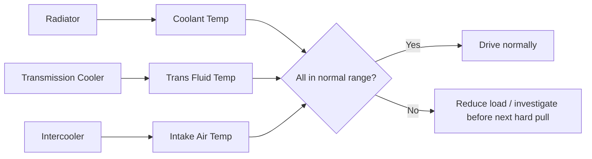

# Maintenance Guide

> **📌 Note:** This chapter is the baseline maintenance schedule for a street-driven,
> eventually-boosted 350Z. Log every one of these jobs in the [Maintenance Log](#maintenance-log)
> when performed. Intervals tighten once Phase 2 adds boost — see the boosted-interval column.

## Why maintenance intervals exist (for first-time owners)

> **📌 Note:** If you've only ever owned cars under warranty where "the dealer handles it,"
> it can be unclear why intervals matter or where the numbers come from. Every interval below
> exists because a specific fluid or part degrades in a specific, predictable way over time
> or heat cycles — it isn't an arbitrary manufacturer upsell. Understanding *why* an interval
> exists makes it much easier to notice when your specific car/driving style needs it sooner.

## Fluids & service intervals

| Item | Stock interval | Boosted/hard-use interval | Notes |
|---|---|---|---|
| Engine oil & filter | 5,000 mi | 3,000–3,500 mi | Use a quality synthetic rated for the heat load; boosted engines run hotter oil |
| Transmission fluid (RE5R05A) | 30,000–60,000 mi (Nissan "long life" claim) | 15,000–20,000 mi | Use exact Nissan-spec ATF (Matic-S / equivalent) — wrong fluid affects shift quality and clutch life |
| Coolant | 30,000 mi / 2 yr | Same, but inspect more often under boost | Confirm mixture and check for contamination at every oil change |
| Differential fluid | 30,000 mi | 15,000–20,000 mi | More important once torque increases in Phase 2 |
| Brake fluid | 2 years | 1 year | Boiling point degrades with moisture absorption — critical once track/canyon use increases |
| Spark plugs | 60,000–100,000 mi (factory iridium) | 20,000–30,000 mi once boosted | Move to a colder heat range plug when power increases — see [Turbo Planning Guide](#turbo-planning-guide) |
| Timing chain guides/tensioner | Inspect at 60,000+ mi or at first sign of rattle | Same | Known VQ35DE wear item — don't defer once rattle is audible |
| Serpentine belt | 60,000 mi | Same | Inspect more often if AC/alternator load increases |
| Air filter | 15,000–30,000 mi | 10,000–15,000 mi or per turbo kit's intake design | High-flow filter recommended once boosted |
| Fuel filter (if serviceable) | 30,000 mi | 15,000–20,000 mi | Critical once fuel system is upgraded for Phase 2 |
| Cabin air filter | 15,000–20,000 mi | Same | Doesn't affect performance, affects AC/heater airflow and smell |
| Wheel bearings | Inspect at 60,000+ mi, replace on noise/play | Same | Listen for a speed-varying hum/growl; check for play with wheel off ground |

### Why each fluid actually degrades (plain-English explainer)

| Fluid | What "wears out" about it |
|---|---|
| Engine oil | Loses viscosity and picks up combustion byproducts/soot over time and heat cycles — a thin, dirty oil protects less well |
| Transmission fluid | Friction modifiers and clutch-conditioning additives break down under heat, and clutch material sheds into the fluid over time |
| Coolant | Corrosion inhibitors deplete over time, allowing internal corrosion even if the coolant still looks fine |
| Brake fluid | Absorbs moisture from the air over time (it's hygroscopic), which lowers its boiling point and can cause a spongy pedal or fade under heat |
| Differential fluid | Contains extreme-pressure additives that shear down under load, plus picks up metal wear particles over time |

## Maintenance timeline at a glance

```mermaid
%% diagram-id: maintenance-timeline
gantt
    title Illustrative maintenance timeline (stock/N/A use, miles as proxy for time)
    dateFormat  X
    axisFormat %s mi
    section Frequent
    Oil & filter              :0, 5000
    Seasonal checks           :0, 3000
    section Mid-interval
    Cabin air filter          :0, 17500
    Air filter                :0, 20000
    Differential fluid        :0, 30000
    Coolant                   :0, 30000
    Fuel filter                :0, 30000
    section Long-interval
    Transmission fluid        :0, 45000
    Serpentine belt            :0, 60000
    Spark plugs                :0, 80000
```

> **📌 Note:** This chart uses mileage as a stand-in for time and is illustrative, not exact —
> use the table above for the real ranges, and always default to the *shorter* interval if
> you're unsure which applies to your driving.

## Symptom-to-cause quick reference

> **💡 Tip for beginners:** Not sure what's wrong? Start here before assuming the worst.

| Symptom | Most likely cause(s) | Where to read more |
|---|---|---|
| Rattle for 1–2 seconds on cold start only | Normal wear-related timing chain guide slack — monitor | This chapter, fluids table |
| Rattle that lasts longer or gets louder over weeks | Timing chain guide/tensioner wear worsening | This chapter; consider a shop inspection soon |
| RPM flares before a gear catches | Transmission clutch/band wear, or low/degraded fluid | [Buyer's Guide](#the-350z-buyers-guide), [Phase 2](#phase-2-the-500-hp-plan) |
| Clunk on deceleration | Worn differential mount/bushing, or worn diff internals | [Buyer's Guide](#the-350z-buyers-guide) known issues |
| Spongy brake pedal | Air in brake lines, or old/moisture-saturated brake fluid | [Brake Guide](#brake-guide) |
| Steering wheel shakes at speed | Warped rotor, or wheel/tire balance issue | [Brake Guide](#brake-guide), [Wheel & Tire Guide](#wheel--tire-guide) |
| Clunk over bumps | Worn sway bar end links or control arm bushings | [Suspension Guide](#suspension-guide) |
| Whine that changes pitch with speed | Differential or wheel bearing wear | [Buyer's Guide](#the-350z-buyers-guide) |
| Rough idle, hesitation | Aging spark plugs, vacuum leak, or dirty injectors | This chapter's fluids/intervals table |

## Torque spec quick reference

> **⚠️ Caution:** Always confirm exact torque specs against the official Nissan factory
> service manual for your specific VIN before fastening anything safety-critical. The values
> below are a working reference, not a substitute for the FSM.

| Fastener | Typical torque (reference only — verify against FSM) |
|---|---|
| Wheel lug nuts | ~80–90 ft-lb |
| Oil drain plug | ~25–29 ft-lb |
| Spark plugs | ~13–18 ft-lb |
| Front lower control arm bolts | ~65–90 ft-lb (varies by bolt) |
| Brake caliper bracket bolts | ~65–80 ft-lb |
| Sway bar end link | ~35–45 ft-lb |

> **📌 Note for beginners: what is an "FSM"?** The Factory Service Manual — Nissan's own
> official repair documentation for this exact car, covering every torque spec, procedure,
> and wiring diagram. It's worth tracking down a copy (digital scans circulate widely) before
> doing any DIY work beyond the basics in this chapter.

## A first-timer's step-by-step oil change

> **✅ Checklist**
> - [ ] 1. Warm the engine briefly (a couple of minutes) so oil flows and drains faster —
>   not so hot you'll burn yourself
> - [ ] 2. Lift and support the car safely (see [Beginner Car Guide](#beginner-car-guide)
>   lifting procedure)
> - [ ] 3. Place a drain pan under the drain plug, then remove the plug and let it fully drain
> - [ ] 4. While draining, remove and replace the oil filter (have a small amount of oil
>   ready to lubricate the new filter's gasket before installing)
> - [ ] 5. Reinstall the drain plug to spec torque (see table above) — do not overtighten
> - [ ] 6. Refill with the correct oil grade/quantity per the FSM
> - [ ] 7. Start the engine, check for leaks at the filter and drain plug while it runs
>   briefly, then shut off and recheck the level once settled
> - [ ] 8. Log the service in the [Maintenance Log](#maintenance-log), including mileage
> - [ ] 9. Dispose of old oil/filter at a recycling-accepting auto parts store — never pour
>   it out or put it in household trash

## Seasonal / condition-based checks

> **✅ Checklist — every 3 months or 3,000 miles, whichever first**
> - [ ] Tire pressure and tread depth (all four + spare)
> - [ ] Brake pad thickness, visually through the wheel
> - [ ] Fluid levels: oil, coolant, transmission, brake, power steering, washer
> - [ ] Battery terminals clean and tight
> - [ ] Belts and visible hoses inspected for cracking
> - [ ] Underbody visual for new leaks or drips
> - [ ] All lights functioning (headlights, brake lights, turn signals)

## Seasonal prep: winter and summer

> **✅ Checklist — before winter (if you're in a cold climate)**
> - [ ] Confirm coolant mixture is rated for your region's lowest expected temperature
> - [ ] Check battery health — cold weather is when a marginal battery finally fails
> - [ ] Consider dedicated winter tires if you'll drive in snow/ice — summer performance
>   tires lose grip dramatically below about 45°F (7°C), regardless of tread depth
> - [ ] Keep the fuel tank fuller in cold weather to reduce condensation risk

> **✅ Checklist — before summer / hot weather**
> - [ ] Confirm AC blows cold before the heat arrives, not during it
> - [ ] Check coolant level and condition — cooling systems work hardest in summer traffic
> - [ ] Check tire pressures more often — pressure rises and falls more with hot pavement/air

## Cooling system health (critical once boosted)

> **🛑 Critical:** Once Phase 2 boost is added, treat transmission temperature as a
> first-class gauge, not an afterthought. Sustained temps over ~200°F accelerate ATF
> breakdown and clutch wear dramatically. See [Phase 2](#phase-2-the-500-hp-plan) for the
> auxiliary cooler upgrade that this depends on.

## DIY-friendly vs. shop-recommended jobs

| Job | DIY-friendly? | Notes |
|---|---|---|
| Oil & filter change | Yes | Standard tools, low risk |
| Brake pad replacement | Yes | Torque wheel bolts correctly, bed in new pads |
| Spark plug replacement | Yes, moderate | Rear bank access is tighter — patience required |
| Transmission fluid service | Yes, moderate | Correct fluid spec and fill procedure matter — verify fluid level per FSM cold/hot procedure |
| Timing chain guide replacement | Shop-recommended | Requires front cover removal — significant labor, easy to get wrong |
| Turbo kit install | Shop-recommended | See [Turbo Planning Guide](#turbo-planning-guide) |
| ECU tuning | Shop-recommended (professional tuner only) | See [Phase 2](#phase-2-the-500-hp-plan) — this is not a DIY job on a boosted car |
| Alignment | Shop-recommended | Requires an alignment rack for accurate results |
| Wheel bearing replacement | Shop-recommended for first-timers | Requires a press in most cases; getting it wrong affects safety |

## Fuel system safety note

> **🛑 Critical:** The fuel system is under pressure at all times the engine has run
> recently. Relieve fuel pressure per the factory procedure (typically via the fuel pump
> fuse/relay, running the engine until it stalls) before opening any fuel line, filter, or
> injector. Work in a well-ventilated area, away from ignition sources, with a fire
> extinguisher within reach.

## Frequently asked questions

> **Q: I missed an interval by a couple thousand miles — is that a big deal?**
> A modest overshoot on most items (oil, air filter) is low-risk but not free — degraded oil
> still wears the engine faster than fresh oil would have. A significant overshoot on
> transmission fluid or brake fluid is more consequential given how those specific fluids
> degrade (see the explainer table above). When in doubt, service it now and get back on schedule.

> **Q: Can I just use whatever oil/fluid is cheapest at the parts store?**
> For engine oil, match the viscosity grade and quality rating (synthetic recommended,
> especially once boosted) — reputable major brands meeting spec are fine. For transmission
> and differential fluid, use the exact Nissan-specified fluid type, not a generic
> "universal" ATF — the wrong friction modifier chemistry can cause harsh or slipping shifts.

> **Q: How do I know if a shop actually did the service I paid for?**
> Ask for the old parts back (old filter, for example) and an itemized invoice noting fluid
> type/quantity used. Log it immediately in the [Maintenance Log](#maintenance-log) with
> those details while they're fresh.
