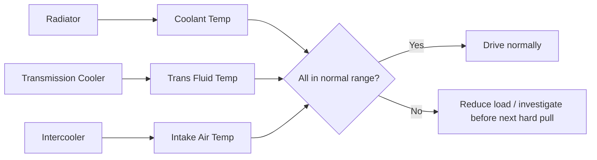

# Maintenance Guide

> **📌 Note:** This chapter is the baseline maintenance schedule for a street-driven,
> eventually-boosted 350Z. Log every one of these jobs in the [Maintenance Log](#maintenance-log)
> when performed. Intervals tighten once Phase 2 adds boost — see the boosted-interval column.

## Fluids & service intervals

| Item | Stock interval | Boosted/hard-use interval | Notes |
|---|---|---|---|
| Engine oil & filter | 5,000 mi | 3,000–3,500 mi | Use a quality synthetic rated for the heat load; boosted engines run hotter oil |
| Transmission fluid (RE5R05A) | 30,000–60,000 mi (Nissan "long life" claim) | 15,000–20,000 mi | Use exact Nissan-spec ATF (Matic-S / equivalent) — wrong fluid affects shift quality and clutch life |
| Coolant | 30,000 mi / 2 yr | Same, but inspect more often under boost | Confirm mixture and check for contamination at every oil change |
| Differential fluid | 30,000 mi | 15,000–20,000 mi | More important once torque increases in Phase 2 |
| Brake fluid | 2 years | 1 year | Boiling point degrades with moisture absorption — critical once track/canyon use increases |
| Spark plugs | 60,000–100,000 mi (factory iridium) | 20,000–30,000 mi once boosted | Move to a colder heat range plug when power increases — see [Turbo Planning Guide](#turbo-planning-guide) |
| Timing chain guides/tensioner | Inspect at 60,000+ mi or at first sign of rattle | Same | Known VQ35DE wear item — don't defer once rattle is audible |
| Serpentine belt | 60,000 mi | Same | Inspect more often if AC/alternator load increases |
| Air filter | 15,000–30,000 mi | 10,000–15,000 mi or per turbo kit's intake design | High-flow filter recommended once boosted |
| Fuel filter (if serviceable) | 30,000 mi | 15,000–20,000 mi | Critical once fuel system is upgraded for Phase 2 |

## Torque spec quick reference

> **⚠️ Caution:** Always confirm exact torque specs against the official Nissan factory
> service manual for your specific VIN before fastening anything safety-critical. The values
> below are a working reference, not a substitute for the FSM.

| Fastener | Typical torque (reference only — verify against FSM) |
|---|---|
| Wheel lug nuts | ~80–90 ft-lb |
| Oil drain plug | ~25–29 ft-lb |
| Spark plugs | ~13–18 ft-lb |
| Front lower control arm bolts | ~65–90 ft-lb (varies by bolt) |
| Brake caliper bracket bolts | ~65–80 ft-lb |
| Sway bar end link | ~35–45 ft-lb |

## Seasonal / condition-based checks

> **✅ Checklist — every 3 months or 3,000 miles, whichever first**
> - [ ] Tire pressure and tread depth (all four + spare)
> - [ ] Brake pad thickness, visually through the wheel
> - [ ] Fluid levels: oil, coolant, transmission, brake, power steering, washer
> - [ ] Battery terminals clean and tight
> - [ ] Belts and visible hoses inspected for cracking
> - [ ] Underbody visual for new leaks or drips
> - [ ] All lights functioning (headlights, brake lights, turn signals)

## Cooling system health (critical once boosted)

> **🛑 Critical:** Once Phase 2 boost is added, treat transmission temperature as a
> first-class gauge, not an afterthought. Sustained temps over ~200°F accelerate ATF
> breakdown and clutch wear dramatically. See [Phase 2](#phase-2-the-500-hp-plan) for the
> auxiliary cooler upgrade that this depends on.

## DIY-friendly vs. shop-recommended jobs

| Job | DIY-friendly? | Notes |
|---|---|---|
| Oil & filter change | Yes | Standard tools, low risk |
| Brake pad replacement | Yes | Torque wheel bolts correctly, bed in new pads |
| Spark plug replacement | Yes, moderate | Rear bank access is tighter — patience required |
| Transmission fluid service | Yes, moderate | Correct fluid spec and fill procedure matter — verify fluid level per FSM cold/hot procedure |
| Timing chain guide replacement | Shop-recommended | Requires front cover removal — significant labor, easy to get wrong |
| Turbo kit install | Shop-recommended | See [Turbo Planning Guide](#turbo-planning-guide) |
| ECU tuning | Shop-recommended (professional tuner only) | See [Phase 2](#phase-2-the-500-hp-plan) — this is not a DIY job on a boosted car |
| Alignment | Shop-recommended | Requires an alignment rack for accurate results |

## Fuel system safety note

> **🛑 Critical:** The fuel system is under pressure at all times the engine has run
> recently. Relieve fuel pressure per the factory procedure (typically via the fuel pump
> fuse/relay, running the engine until it stalls) before opening any fuel line, filter, or
> injector. Work in a well-ventilated area, away from ignition sources, with a fire
> extinguisher within reach.
