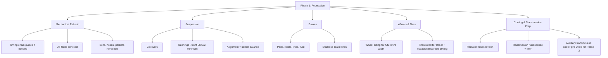
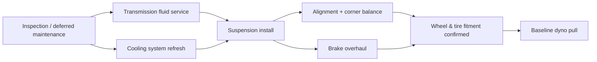

# Phase 1 Build Plan

## Goal of Phase 1

Turn a good-bones automatic 350Z into a **sorted foundation** — one that stops, turns, and
runs cool and reliably — before a single power-adding part goes on. Phase 1 spends roughly
55–65% of the total budget and produces zero extra horsepower on paper, but it's what makes
Phase 2's power actually usable and durable.

> **📌 Note:** It is tempting to skip straight to the turbo kit. Don't. A 500 hp car on
> stock brakes, tired bushings, and 15-year-old suspension is not a "500 hp street car" — 
> it's a liability. Every Phase 1 dollar directly protects the Phase 2 investment.

## For first-timers: why "foundation" work that adds no power still comes first

Think of it like renovating a house: you don't install a bigger furnace before you've fixed
the leaky roof and the cracked foundation — the bigger furnace just makes the existing
problems worse, faster. Phase 1 is the roof and foundation. None of it is glamorous, all of
it is necessary, and skipping it doesn't save money — it just moves the same cost later,
usually with extra damage attached (a failed transmission is a much more expensive fix than
a fluid service would have been).

## Phase 1 scope

## Why this specific order? (the dependency chain)

Some Phase 1 steps genuinely must happen before others; some are just sensible defaults.
Here's which is which:

| Step | Must come before... | Why it's a hard dependency (not just a preference) |
|---|---|---|
| Deferred maintenance addressed | Everything else | No point building on top of an unresolved problem |
| Suspension installed | Alignment | Alignment on the old suspension is wasted work |
| Suspension settled (100–200 mi) | Final alignment | Ride height/geometry shifts as new parts settle |
| Wheels/tires mounted | Final fitment confirmation | Can't confirm clearance without the actual wheels/tires on the car |
| All Phase 1 items done | Baseline dyno pull | The baseline should represent the finished foundation, not a mid-build state |

## Phase 1 checklist, in build order

> **✅ Checklist — recommended sequence**
> - [ ] 1. Pre-purchase or post-purchase full inspection (see [Inspection Checklist](#inspection-checklist))
> - [ ] 2. Address any deferred maintenance found (see [Maintenance Guide](#maintenance-guide))
> - [ ] 3. Transmission fluid + filter service — establish a known-good baseline
> - [ ] 4. Cooling system refresh — radiator, hoses, thermostat if age-appropriate
> - [ ] 5. Brake system overhaul — see [Brake Guide](#brake-guide)
> - [ ] 6. Suspension install — see [Suspension Guide](#suspension-guide)
> - [ ] 7. Wheel & tire fitment sized for the eventual power level — see
>   [Wheel & Tire Guide](#wheel--tire-guide)
> - [ ] 8. Alignment + corner balance after suspension settles (drive 100–200 miles first)
> - [ ] 9. Pre-wire/pre-plumb for the auxiliary transmission cooler that Phase 2 will need
>   (cheap to do now, annoying to retrofit later)
> - [ ] 10. Baseline dyno pull (stock power) for a before/after reference point

## Why the transmission gets attention in Phase 1, not Phase 2

The stock RE5R05A 5-speed automatic is rated around the factory's ~300 hp / 260 lb-ft. It
survives that fine. The moment Phase 2 starts adding boost, torque rises faster than
horsepower at low RPM — exactly where an automatic transmission's clutches and bands are
most stressed. Doing the fluid service, a quality filter, and cooler prep in Phase 1 means:

1. You have a known-good, freshly serviced baseline before adding load.
2. The cooler lines/mounting are already in place, so Phase 2 install time (and shop labor
   cost) drops.
3. You'll notice immediately if the transmission was already marginal, while it's still
   cheap to address — before turbo parts are bolted on.

## DIY vs. shop, by Phase 1 job

> **📌 Note for beginners:** Doing some of this yourself is a legitimate way to stretch the
> budget, but only where the risk of a mistake is low. Below is a starting guide — see also
> the DIY-vs-shop table in the [Maintenance Guide](#maintenance-guide).

| Job | DIY-friendly for a beginner? | If hiring out, what to ask the shop |
|---|---|---|
| Fluid services | Yes, with basic tools | N/A — but keep receipts either way for the [Maintenance Log](#maintenance-log) |
| Cooling system refresh | Moderate | Ask if they pressure-test the system after the work |
| Brake pads/rotors | Yes, with basic tools and patience | Ask if they'll bed in the new pads before handing the car back |
| Coilover install | Moderate-hard, needs a spring compressor and alignment access | Ask if alignment is included or billed separately |
| Alignment | No — needs an alignment rack | Ask for the printed before/after alignment sheet, not just "it's done" |
| Wheel/tire mounting | No — needs a tire machine and balancer | Ask about the torque procedure and re-torque policy after 50–100 miles |

## Getting and comparing shop quotes

> **✅ Checklist — before committing to any Phase 1 shop work**
> - [ ] Get at least two written, itemized quotes for anything over a few hundred dollars
> - [ ] Confirm each quote lists specific parts/brands, not just a lump labor+parts number
> - [ ] Ask each shop directly about experience with this specific chassis/transmission
> - [ ] Confirm whether alignment, fluids, and disposal fees are included or extra
> - [ ] Ask about warranty on labor, separate from any parts warranty

## Common Phase 1 budget surprises (and how to avoid them)

| Surprise | Why it happens | How to avoid it |
|---|---|---|
| Alignment costs more than expected | Corner balancing is sometimes billed separately from a standard alignment | Ask specifically whether corner balance is included when getting quotes |
| Brake kit doesn't clear the chosen wheels | Bought wheels and brakes from different vendors without cross-checking | Confirm brake caliper clearance against wheel specs before ordering either |
| Suspension parts back-ordered | Popular parts sell out ahead of a model's anniversary/season | Order early, confirm stock before scheduling shop time |
| "Minor" maintenance item turns into a bigger job | An issue was worse than it looked at inspection | Keep the [Budget Tracker](#budget-tracker) contingency intact through Phase 1, not just Phase 2 |

## Suggested Phase 1 budget split

| Category | Approx. % of Phase 1 budget | Typical range (of $20K–$28K total budget) |
|---|---|---|
| Mechanical refresh & fluids | 10–15% | $1,200–$2,500 |
| Brakes | 20–25% | $2,500–$4,500 |
| Suspension | 25–30% | $3,000–$5,500 |
| Wheels & tires | 20–25% | $2,500–$4,500 |
| Cooling/transmission prep | 10–15% | $1,200–$2,500 |

See the [Budget Tracker](#budget-tracker) for the full worksheet and the
[Parts List](#parts-list) for specific part categories and price bands.

## Exit criteria — when Phase 1 is actually done

> **✅ Checklist — do not start Phase 2 until all boxes are checked**
> - [ ] No outstanding maintenance items from the Inspection Checklist remain open
> - [ ] Suspension installed, aligned, and corner-balanced
> - [ ] Brakes upgraded to a spec appropriate for the Phase 2 power target (see
>   [Brake Guide](#brake-guide))
> - [ ] Wheels/tires sized for the eventual power and confirmed to clear the suspension
>   at full lock and full compression
> - [ ] Transmission serviced with correct fluid, cooler lines pre-run
> - [ ] Baseline dyno pull logged in the [Modification Log](#modification-log)
> - [ ] Phase 1 spend reconciled in the [Budget Tracker](#budget-tracker) — confirm Phase 2
>   budget remaining before ordering turbo parts

## Frequently asked questions

> **Q: Can I do Phase 1 and Phase 2 items at the same time to save shop visits?**
> Some overlap is fine (e.g., ordering Phase 2 parts while Phase 1 labor is scheduled), but
> installing Phase 2 power parts before Phase 1's brakes/suspension/transmission prep is
> complete is exactly the sequencing this book advises against — see
> [Project Vision](#project-vision) non-negotiables.

> **Q: What if I already have good aftermarket suspension/brakes from a previous owner?**
> Verify, don't assume — inspect condition, confirm correct install (torque, alignment
> history), and compare specs against this chapter's recommendations before crediting it as
> "already done."

> **Q: My budget is tight — can I skip the baseline dyno pull?**
> It's the one item in Phase 1 that's genuinely optional if budget is very tight, since it
> doesn't affect safety or reliability — but it's a small cost for a real reference point
> that makes Phase 2's gains concrete and helps a tuner understand your specific car's
> starting point.
