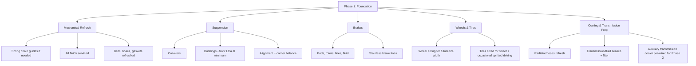

# Phase 1 Build Plan

## Goal of Phase 1

Turn a good-bones automatic 350Z into a **sorted foundation** — one that stops, turns, and
runs cool and reliably — before a single power-adding part goes on. Phase 1 spends roughly
55–65% of the total budget and produces zero extra horsepower on paper, but it's what makes
Phase 2's power actually usable and durable.

> **📌 Note:** It is tempting to skip straight to the turbo kit. Don't. A 500 hp car on
> stock brakes, tired bushings, and 15-year-old suspension is not a "500 hp street car" — 
> it's a liability. Every Phase 1 dollar directly protects the Phase 2 investment.

## Phase 1 scope

## Phase 1 checklist, in build order

> **✅ Checklist — recommended sequence**
> - [ ] 1. Pre-purchase or post-purchase full inspection (see [Inspection Checklist](#inspection-checklist))
> - [ ] 2. Address any deferred maintenance found (see [Maintenance Guide](#maintenance-guide))
> - [ ] 3. Transmission fluid + filter service — establish a known-good baseline
> - [ ] 4. Cooling system refresh — radiator, hoses, thermostat if age-appropriate
> - [ ] 5. Brake system overhaul — see [Brake Guide](#brake-guide)
> - [ ] 6. Suspension install — see [Suspension Guide](#suspension-guide)
> - [ ] 7. Wheel & tire fitment sized for the eventual power level — see
>   [Wheel & Tire Guide](#wheel--tire-guide)
> - [ ] 8. Alignment + corner balance after suspension settles (drive 100–200 miles first)
> - [ ] 9. Pre-wire/pre-plumb for the auxiliary transmission cooler that Phase 2 will need
>   (cheap to do now, annoying to retrofit later)
> - [ ] 10. Baseline dyno pull (stock power) for a before/after reference point

## Why the transmission gets attention in Phase 1, not Phase 2

The stock RE5R05A 5-speed automatic is rated around the factory's ~300 hp / 260 lb-ft. It
survives that fine. The moment Phase 2 starts adding boost, torque rises faster than
horsepower at low RPM — exactly where an automatic transmission's clutches and bands are
most stressed. Doing the fluid service, a quality filter, and cooler prep in Phase 1 means:

1. You have a known-good, freshly serviced baseline before adding load.
2. The cooler lines/mounting are already in place, so Phase 2 install time (and shop labor
   cost) drops.
3. You'll notice immediately if the transmission was already marginal, while it's still
   cheap to address — before turbo parts are bolted on.

## Suggested Phase 1 budget split

| Category | Approx. % of Phase 1 budget | Typical range (of $20K–$28K total budget) |
|---|---|---|
| Mechanical refresh & fluids | 10–15% | $1,200–$2,500 |
| Brakes | 20–25% | $2,500–$4,500 |
| Suspension | 25–30% | $3,000–$5,500 |
| Wheels & tires | 20–25% | $2,500–$4,500 |
| Cooling/transmission prep | 10–15% | $1,200–$2,500 |

See the [Budget Tracker](#budget-tracker) for the full worksheet and the
[Parts List](#parts-list) for specific part categories and price bands.

## Exit criteria — when Phase 1 is actually done

> **✅ Checklist — do not start Phase 2 until all boxes are checked**
> - [ ] No outstanding maintenance items from the Inspection Checklist remain open
> - [ ] Suspension installed, aligned, and corner-balanced
> - [ ] Brakes upgraded to a spec appropriate for the Phase 2 power target (see
>   [Brake Guide](#brake-guide))
> - [ ] Wheels/tires sized for the eventual power and confirmed to clear the suspension
>   at full lock and full compression
> - [ ] Transmission serviced with correct fluid, cooler lines pre-run
> - [ ] Baseline dyno pull logged in the [Modification Log](#modification-log)
> - [ ] Phase 1 spend reconciled in the [Budget Tracker](#budget-tracker) — confirm Phase 2
>   budget remaining before ordering turbo parts
