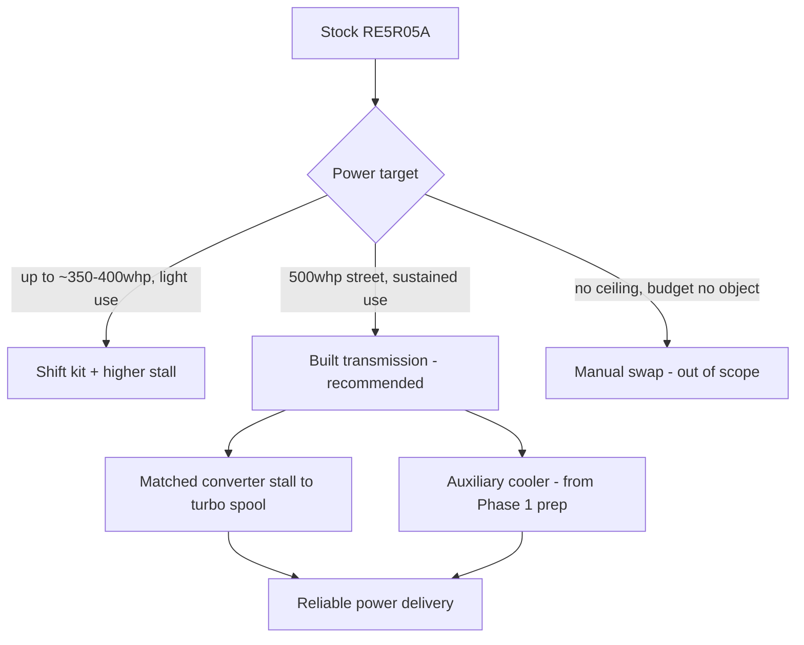
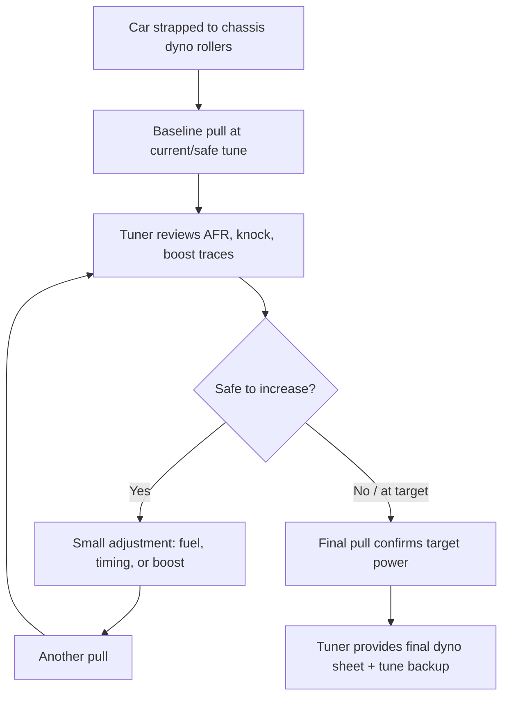

# Phase 2: The 500 HP Plan

## Goal of Phase 2

Take the sorted Phase 1 foundation and add power the disciplined way: transmission first,
fueling second, turbo system third, tune last — validated on the dyno and the street before
calling it done.

> **🛑 Critical:** Do not reorder this sequence. Turbo kits are the fun part, but a
> transmission or fuel system that can't support the power will fail first and can take
> other parts with it (a slipping transmission generates heat that cooks fluid and clutches;
> a lean-out from an undersized fuel system can destroy an engine in seconds).

## For first-timers: why torque, not horsepower, is what breaks a transmission

Horsepower is a rate (how fast work gets done); torque is a twisting force. A transmission's
clutches and bands have to physically clamp hard enough to hold that twisting force without
slipping. Turbocharging especially raises torque *low in the RPM range* — exactly where a
transmission is working hardest to multiply engine output into road speed. That's the
concrete, physical reason "500 hp" is a transmission problem as much as an engine problem,
and why this chapter puts the transmission first, not the turbo.

## The transmission problem — read this first

The stock RE5R05A automatic is not built for 500 hp at the wheels. There are three realistic
paths, in order of typical cost:

| Path | What it involves | Approx. relative cost | Notes |
|---|---|---|---|
| Shift kit + upgraded valve body + higher-stall converter | Firms up shifts, raises clutch clamping pressure, matches converter to the power/RPM band | $$ | Minimum viable upgrade for this power level; still has a ceiling |
| Built transmission (aftermarket clutch packs, hardened hard parts, built converter) | Full transmission build by a shop specializing in JATCO/Nissan automatics | $$$ | Recommended path for sustained 500 whp street use |
| Manual swap | Swap to the factory 6-speed manual and matching driveline | $$$$ | Outside this book's scope/budget envelope, but worth knowing it exists as the ceiling option |

**This book's default plan is the built transmission path** — it fits the budget envelope
and matches the "reliable" requirement in the [Project Vision](#project-vision) better than
a shift kit alone, which tends to become a recurring expense at this power level.

## Plain-English: what a torque converter and "stall speed" actually are

> **📌 Note:** These terms come up constantly once you're talking to a transmission shop —
> worth understanding before that conversation, not during it.

- A **torque converter** is a fluid coupling — think of two fans facing each other in a
  sealed housing full of fluid, one spun by the engine, the other connected to the
  transmission. It lets the engine keep spinning at idle while the car is stopped in gear,
  instead of stalling like a manual clutch would.
- **Stall speed** is the RPM the engine reaches against a stopped car before the converter
  "locks up" enough to start moving the car. A higher-stall converter lets the engine spin
  up closer to its powerband (and, for a turbo car, closer to where the turbo starts making
  boost) before power transfers to the wheels — which is why it needs to be matched to your
  specific turbo's spool characteristics, not just picked for a big number.

## What a transmission shop should be able to explain to you

> **✅ Checklist — questions to ask before committing to a transmission build**
> - [ ] What specific clutch/band upgrades are included, and why (not just "heavy duty")
> - [ ] What stall speed converter they're recommending, and how it was matched to your
>   turbo's spool characteristics
> - [ ] Whether the valve body is being upgraded/reprogrammed and what that changes
> - [ ] What their warranty covers and for how long
> - [ ] Whether they've built this specific transmission (RE5R05A) before, and for
>   approximately what power level
> - [ ] Expected turnaround time and whether that includes converter build/balancing time

## Phase 2 build order

> **✅ Checklist — build in this order**
> - [ ] 1. Transmission upgrade (built unit + matched converter) installed and validated
> - [ ] 2. Fuel system upgrade — injectors, fuel pump, lines sized for target power (see
>   [Turbo Planning Guide](#turbo-planning-guide) for sizing math)
> - [ ] 3. Supporting hardware: upgraded intercooler, exhaust, downpipe, oil/coolant lines
>   for the turbo
> - [ ] 4. Turbo kit installation (single-turbo, moderate boost — see
>   [Turbo Planning Guide](#turbo-planning-guide) for why this path was chosen)
> - [ ] 5. Standalone or piggyback ECU tuning solution installed
> - [ ] 6. Initial conservative tune (safe, low-boost baseline) + road test
> - [ ] 7. Dyno tuning session(s) — progressive boost increase with full AFR/knock logging
> - [ ] 8. Data-logged street validation — see exit criteria below
> - [ ] 9. Final tune locked in, documented, and backed up

## What actually happens during a dyno tuning session (for first-timers)

If you've never seen one, a dyno day usually looks like this:

> **💡 Tip:** Plan for a half-day to a full day at the dyno, not an hour. Good tuning is
> iterative — many small, verified steps, not one big pull to the target number. Bring a
> ride or entertainment; you likely won't be needed for most of it beyond the initial car
> hand-off and periodic check-ins.

## Choosing a tuner

> **✅ Checklist**
> - [ ] Verifiable experience tuning turbocharged VQ35DE-equipped cars specifically
> - [ ] Willing to show you example dyno sheets/logs from past work (with AFR/knock traces,
>   not just peak power)
> - [ ] Clear about what's included (number of pulls/sessions) versus billed extra
> - [ ] Provides you a copy of your own tune file and dyno sheets — you should never be
>   locked out of your own car's data
> - [ ] Willing to explain their approach to your specific goals (street-reliable, not just
>   peak number) — see [Project Vision](#project-vision) non-negotiables

## Supporting systems checklist

> **✅ Checklist**
> - [ ] Fuel pump upgraded to support target flow at target fuel pressure
> - [ ] Injectors sized with headroom above target power (not right at the edge of duty cycle)
> - [ ] Intercooler sized to keep intake air temps in check on repeated pulls, not just one dyno run
> - [ ] Exhaust/downpipe diameter matched to turbo housing flow, not just "biggest is best"
> - [ ] Transmission cooler lines from Phase 1 connected to the new/built transmission
> - [ ] Boost controller (electronic preferred) installed with a safe default/failsafe boost level
> - [ ] Wideband AFR gauge or logging sensor installed and visible/loggable at all times
> - [ ] Knock monitoring active in the tune and logged on every dyno pull

## Realistic power/cost checkpoints

| Milestone | What's installed | Approx. cumulative spend (of Phase 2 budget) | Expected whp |
|---|---|---|---|
| Transmission + fuel system done | Built trans, converter, injectors, pump | 35–40% | ~300 whp (no boost yet, N/A baseline) |
| Turbo hardware installed, safe base tune | Turbo, intercooler, exhaust, initial 5–6 psi tune | 70–80% | ~400–430 whp |
| Dyno-tuned to target boost | Progressive tuning to 10–12 psi | 90–100% | ~480–520 whp |
| Street validation complete | Same hardware, confirmed reliable | 100% | 500 whp target, documented |

See the [Budget Tracker](#budget-tracker) for the live worksheet version of this table.

## Warning signs during Phase 2 that mean "stop and investigate"

> **🛑 Critical — pull over / stop the dyno session if you notice:**
> - Any burning smell, especially electrical or clutch-like
> - A sudden change in shift quality (harsher, slower, or a flare that wasn't there before)
> - Any warning light, especially anything related to transmission, knock, or misfire
> - Fluid on the ground under the car after a hard run
> - A knock/pinging sound under load that wasn't present on a previous pull

## Exit criteria — when Phase 2 (and the build) is done

> **✅ Checklist**
> - [ ] Dyno sheet on file showing target power with a clean AFR trace (no dangerous lean
>   spikes) and no knock retard beyond the tuner's safe margin
> - [ ] At least 500 street miles logged post-tune with no limp mode, no fluid leaks, no
>   check-engine lights
> - [ ] Transmission temps confirmed under 200°F in normal street driving (see
>   [Maintenance Guide](#maintenance-guide))
> - [ ] Tune file and dyno sheets backed up and stored (physical + digital copy)
> - [ ] Every part logged in the [Modification Log](#modification-log)
> - [ ] Final spend reconciled against the [Budget Tracker](#budget-tracker)

> **💡 Tip:** Budget a second, follow-up dyno session 500–1,000 miles after the initial tune.
> Parts seat, fuel trims settle, and a "re-tune to confirm" session is cheap insurance
> against a tune that was only ever validated on day one.

## Frequently asked questions

> **Q: Can I skip the built transmission and just try a shift kit first?**
> You can, if your realistic power target is closer to 350–400 whp and you accept the lower
> ceiling — see the comparison table above. Going straight to a full turbo build on a shift
> kit alone, targeting 500 whp, is exactly the scenario this book's transmission-first
> sequencing exists to prevent.

> **Q: How do I know if my fuel system is "sized right" without doing the math myself?**
> A competent tuner/turbo shop will size injectors and fuel pump against your specific
> target power with headroom, as part of the build — see the sizing discussion in the
> [Turbo Planning Guide](#turbo-planning-guide). Ask them to show you the numbers, not just
> take "it'll be fine" as an answer.

> **Q: What if the dyno day doesn't hit 500 whp?**
> A tuner prioritizing safety may stop short of a specific number if the car shows knock,
> lean spots, or anything else concerning at that boost level — that's the tune working
> correctly, not a failure. Revisit supporting hardware (intercooler efficiency, fuel supply,
> exhaust flow) before just adding more boost to chase the number.
