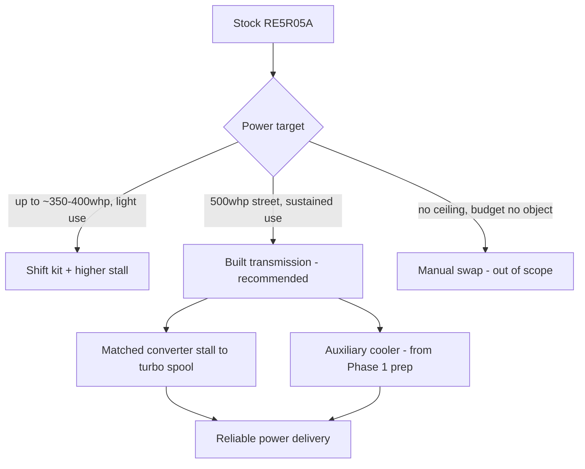

# Phase 2: The 500 HP Plan

## Goal of Phase 2

Take the sorted Phase 1 foundation and add power the disciplined way: transmission first,
fueling second, turbo system third, tune last — validated on the dyno and the street before
calling it done.

> **🛑 Critical:** Do not reorder this sequence. Turbo kits are the fun part, but a
> transmission or fuel system that can't support the power will fail first and can take
> other parts with it (a slipping transmission generates heat that cooks fluid and clutches;
> a lean-out from an undersized fuel system can destroy an engine in seconds).

## The transmission problem — read this first

The stock RE5R05A automatic is not built for 500 hp at the wheels. There are three realistic
paths, in order of typical cost:

| Path | What it involves | Approx. relative cost | Notes |
|---|---|---|---|
| Shift kit + upgraded valve body + higher-stall converter | Firms up shifts, raises clutch clamping pressure, matches converter to the power/RPM band | $$ | Minimum viable upgrade for this power level; still has a ceiling |
| Built transmission (aftermarket clutch packs, hardened hard parts, built converter) | Full transmission build by a shop specializing in JATCO/Nissan automatics | $$$ | Recommended path for sustained 500 whp street use |
| Manual swap | Swap to the factory 6-speed manual and matching driveline | $$$$ | Outside this book's scope/budget envelope, but worth knowing it exists as the ceiling option |

**This book's default plan is the built transmission path** — it fits the budget envelope
and matches the "reliable" requirement in the [Project Vision](#project-vision) better than
a shift kit alone, which tends to become a recurring expense at this power level.

## Phase 2 build order

> **✅ Checklist — build in this order**
> - [ ] 1. Transmission upgrade (built unit + matched converter) installed and validated
> - [ ] 2. Fuel system upgrade — injectors, fuel pump, lines sized for target power (see
>   [Turbo Planning Guide](#turbo-planning-guide) for sizing math)
> - [ ] 3. Supporting hardware: upgraded intercooler, exhaust, downpipe, oil/coolant lines
>   for the turbo
> - [ ] 4. Turbo kit installation (single-turbo, moderate boost — see
>   [Turbo Planning Guide](#turbo-planning-guide) for why this path was chosen)
> - [ ] 5. Standalone or piggyback ECU tuning solution installed
> - [ ] 6. Initial conservative tune (safe, low-boost baseline) + road test
> - [ ] 7. Dyno tuning session(s) — progressive boost increase with full AFR/knock logging
> - [ ] 8. Data-logged street validation — see exit criteria below
> - [ ] 9. Final tune locked in, documented, and backed up

## Supporting systems checklist

> **✅ Checklist**
> - [ ] Fuel pump upgraded to support target flow at target fuel pressure
> - [ ] Injectors sized with headroom above target power (not right at the edge of duty cycle)
> - [ ] Intercooler sized to keep intake air temps in check on repeated pulls, not just one dyno run
> - [ ] Exhaust/downpipe diameter matched to turbo housing flow, not just "biggest is best"
> - [ ] Transmission cooler lines from Phase 1 connected to the new/built transmission
> - [ ] Boost controller (electronic preferred) installed with a safe default/failsafe boost level
> - [ ] Wideband AFR gauge or logging sensor installed and visible/loggable at all times
> - [ ] Knock monitoring active in the tune and logged on every dyno pull

## Realistic power/cost checkpoints

| Milestone | What's installed | Approx. cumulative spend (of Phase 2 budget) | Expected whp |
|---|---|---|---|
| Transmission + fuel system done | Built trans, converter, injectors, pump | 35–40% | ~300 whp (no boost yet, N/A baseline) |
| Turbo hardware installed, safe base tune | Turbo, intercooler, exhaust, initial 5–6 psi tune | 70–80% | ~400–430 whp |
| Dyno-tuned to target boost | Progressive tuning to 10–12 psi | 90–100% | ~480–520 whp |
| Street validation complete | Same hardware, confirmed reliable | 100% | 500 whp target, documented |

See the [Budget Tracker](#budget-tracker) for the live worksheet version of this table.

## Exit criteria — when Phase 2 (and the build) is done

> **✅ Checklist**
> - [ ] Dyno sheet on file showing target power with a clean AFR trace (no dangerous lean
>   spikes) and no knock retard beyond the tuner's safe margin
> - [ ] At least 500 street miles logged post-tune with no limp mode, no fluid leaks, no
>   check-engine lights
> - [ ] Transmission temps confirmed under 200°F in normal street driving (see
>   [Maintenance Guide](#maintenance-guide))
> - [ ] Tune file and dyno sheets backed up and stored (physical + digital copy)
> - [ ] Every part logged in the [Modification Log](#modification-log)
> - [ ] Final spend reconciled against the [Budget Tracker](#budget-tracker)

> **💡 Tip:** Budget a second, follow-up dyno session 500–1,000 miles after the initial tune.
> Parts seat, fuel trims settle, and a "re-tune to confirm" session is cheap insurance
> against a tune that was only ever validated on day one.
