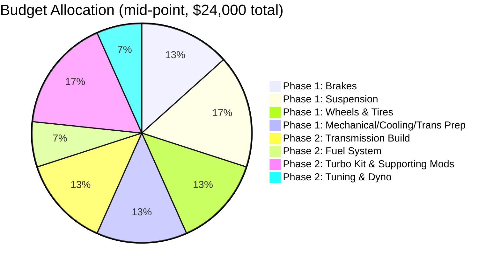

# Budget Tracker

> **📌 Note:** This is a working worksheet, not just a reference table. Update the "Actual"
> column as you spend, and reconcile against the [Expense Tracker](#expense-tracker), which
> logs every individual purchase. This chapter tracks the plan by category; the Expense
> Tracker tracks reality line-by-line.

## Total budget envelope

| | Low end | High end |
|---|---|---|
| **Total build budget (excludes purchase price)** | $20,000 | $28,000 |
| Phase 1 — Foundation (~60%) | $12,000 | $16,800 |
| Phase 2 — 500 HP (~40%) | $8,000 | $11,200 |

> **⚠️ Caution:** The Mermaid pie chart above uses illustrative example numbers at the
> $24,000 mid-point of the budget envelope. Replace these with your own allocations once
> you've priced parts in the [Parts List](#parts-list) — do not treat these as prices.

## Phase 1 worksheet

| Category | Planned (low) | Planned (high) | Actual spent | Remaining | Notes |
|---|---|---|---|---|---|
| Mechanical refresh & fluids | $1,200 | $2,500 | $0 | — | Timing chain guides, fluids, belts |
| Brakes | $2,500 | $4,500 | $0 | — | See [Brake Guide](#brake-guide) |
| Suspension | $3,000 | $5,500 | $0 | — | See [Suspension Guide](#suspension-guide) |
| Wheels & tires | $2,500 | $4,500 | $0 | — | See [Wheel & Tire Guide](#wheel--tire-guide) |
| Cooling & transmission prep | $1,200 | $2,500 | $0 | — | Cooler pre-plumb, fluid service |
| Pre-purchase inspection / diagnostics | $150 | $400 | $0 | — | One-time |
| **Phase 1 subtotal** | **$10,550** | **$19,900** | **$0** | — | Trim to fit the 60% target |

## Phase 2 worksheet

| Category | Planned (low) | Planned (high) | Actual spent | Remaining | Notes |
|---|---|---|---|---|---|
| Transmission build | $2,500 | $4,500 | $0 | — | Built unit + converter, see [Phase 2](#phase-2-the-500-hp-plan) |
| Fuel system | $1,200 | $2,200 | $0 | — | Pump, injectors, lines |
| Turbo kit & supporting mods | $3,000 | $5,500 | $0 | — | Turbo, intercooler, exhaust — see [Turbo Planning Guide](#turbo-planning-guide) |
| ECU / tuning hardware | $800 | $1,500 | $0 | — | Standalone or piggyback ECU |
| Dyno tuning sessions | $600 | $1,200 | $0 | — | Budget for 2 sessions (initial + follow-up) |
| **Phase 2 subtotal** | **$8,100** | **$14,900** | **$0** | — | Trim to fit the 40% target |

## Running total

| | Planned (low) | Planned (high) | Actual | Remaining budget |
|---|---|---|---|---|
| Phase 1 subtotal | $10,550 | $19,900 | $0 | — |
| Phase 2 subtotal | $8,100 | $14,900 | $0 | — |
| **Grand total** | **$18,650** | **$28,000** | **$0** | Compare against $20K–$28K envelope |

> **💡 Tip:** Re-total this chapter every time you close out a category (e.g., "Brakes
> done") rather than waiting until the end — it's much easier to trim Phase 2 scope early
> than to discover you're over budget after ordering the turbo kit.

## Contingency

> **✅ Checklist**
> - [ ] Reserve 8–10% of total budget as contingency, not allocated to any category above
> - [ ] Contingency covers: shipping damage, a part that doesn't fit and needs a workaround,
>   a shop finding an issue mid-install, or a tune that needs an extra dyno session
> - [ ] If contingency is untouched by the end of Phase 2, it becomes the start of your
>   "second re-tune session" fund mentioned in [Phase 2](#phase-2-the-500-hp-plan)
