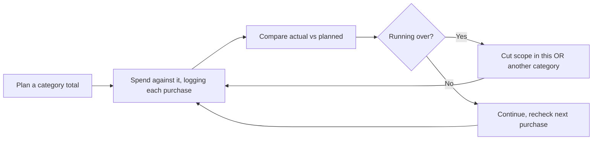
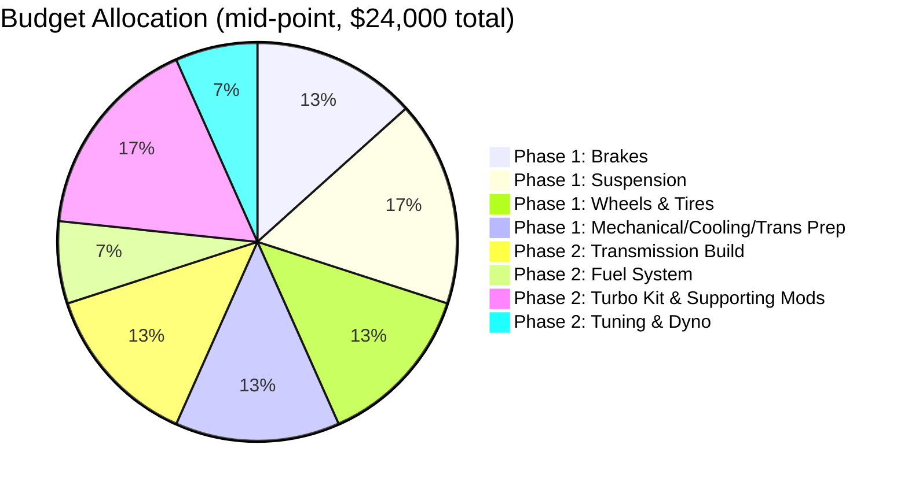
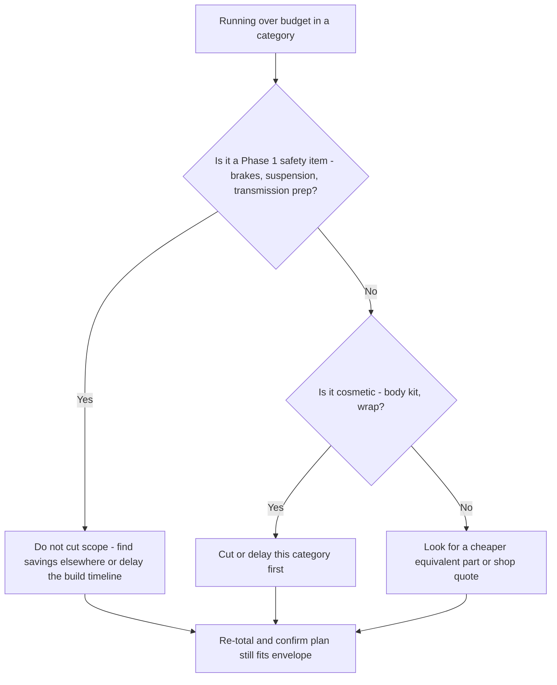

# Budget Tracker

> **📌 Note:** This is a working worksheet, not just a reference table. Update the "Actual"
> column as you spend, and reconcile against the [Expense Tracker](#expense-tracker), which
> logs every individual purchase. This chapter tracks the plan by category; the Expense
> Tracker tracks reality line-by-line.

## Budgeting basics, for anyone who's never run a project budget before

> **📌 Note:** A build budget isn't a single number — it's three numbers you track
> side-by-side: what you **planned** to spend (per category), what you've **actually**
> spent, and what's **remaining**. The whole point of tracking all three, instead of just
> watching your bank balance, is that it tells you *which category* is running over before
> the whole budget is blown — early enough to still do something about it.

## Total budget envelope

| | Low end | High end |
|---|---|---|
| **Total build budget (excludes purchase price)** | $20,000 | $28,000 |
| Phase 1 — Foundation (~60%) | $12,000 | $16,800 |
| Phase 2 — 500 HP (~40%) | $8,000 | $11,200 |

> **⚠️ Caution:** The Mermaid pie chart above uses illustrative example numbers at the
> $24,000 mid-point of the budget envelope. Replace these with your own allocations once
> you've priced parts in the [Parts List](#parts-list) — do not treat these as prices.

## Phase 1 worksheet

| Category | Planned (low) | Planned (high) | Actual spent | Remaining | Notes |
|---|---|---|---|---|---|
| Mechanical refresh & fluids | $1,200 | $2,500 | $0 | — | Timing chain guides, fluids, belts |
| Brakes | $2,500 | $4,500 | $0 | — | See [Brake Guide](#brake-guide) |
| Suspension | $3,000 | $5,500 | $0 | — | See [Suspension Guide](#suspension-guide) |
| Wheels & tires | $2,500 | $4,500 | $0 | — | See [Wheel & Tire Guide](#wheel--tire-guide) |
| Cooling & transmission prep | $1,200 | $2,500 | $0 | — | Cooler pre-plumb, fluid service |
| Pre-purchase inspection / diagnostics | $150 | $400 | $0 | — | One-time |
| **Phase 1 subtotal** | **$10,550** | **$19,900** | **$0** | — | Trim to fit the 60% target |

## Phase 2 worksheet

| Category | Planned (low) | Planned (high) | Actual spent | Remaining | Notes |
|---|---|---|---|---|---|
| Transmission build | $2,500 | $4,500 | $0 | — | Built unit + converter, see [Phase 2](#phase-2-the-500-hp-plan) |
| Fuel system | $1,200 | $2,200 | $0 | — | Pump, injectors, lines |
| Turbo kit & supporting mods | $3,000 | $5,500 | $0 | — | Turbo, intercooler, exhaust — see [Turbo Planning Guide](#turbo-planning-guide) |
| ECU / tuning hardware | $800 | $1,500 | $0 | — | Standalone or piggyback ECU |
| Dyno tuning sessions | $600 | $1,200 | $0 | — | Budget for 2 sessions (initial + follow-up) |
| **Phase 2 subtotal** | **$8,100** | **$14,900** | **$0** | — | Trim to fit the 40% target |

## Running total

| | Planned (low) | Planned (high) | Actual | Remaining budget |
|---|---|---|---|---|
| Phase 1 subtotal | $10,550 | $19,900 | $0 | — |
| Phase 2 subtotal | $8,100 | $14,900 | $0 | — |
| **Grand total** | **$18,650** | **$28,000** | **$0** | Compare against $20K–$28K envelope |

> **💡 Tip:** Re-total this chapter every time you close out a category (e.g., "Brakes
> done") rather than waiting until the end — it's much easier to trim Phase 2 scope early
> than to discover you're over budget after ordering the turbo kit.

## A recommended budgeting cadence

> **✅ Checklist — do this on a regular schedule, not just "when I remember"**
> - [ ] Weekly during active build phases: log every purchase in the
>   [Expense Tracker](#expense-tracker) as it happens, not from memory later
> - [ ] Monthly: re-total this chapter's worksheets and compare actual vs. planned per category
> - [ ] At the close of each category (e.g., "brakes are done"): lock in the actual total and
>   note any variance and why
> - [ ] Before ordering anything in the next category: confirm remaining budget still
>   supports it

## How to cut costs without cutting corners on safety

> **💡 Tips — where it's safe to save money, and where it isn't**

| Safe ways to save | Not safe ways to save |
|---|---|
| Buy suspension/wheels during a sale/off-season | Skip the alignment after suspension work |
| Do DIY-friendly maintenance yourself (see [Maintenance Guide](#maintenance-guide)) | Skip transmission fluid service before adding power |
| Shop multiple quotes for labor-heavy jobs | Choose the cheapest tuner with no verifiable experience on this platform |
| Buy quality used wheels in good condition | Buy a used, unknown-history turbo kit with no inspection |
| Delay cosmetic items (see [Body Kit & Wrap Guide](#body-kit--wrap-guide)) | Undersize the fuel system to save money on injectors/pump |
| Space out Phase 2 purchases as budget allows | Skip the second, follow-up dyno session entirely |

## What to do if you're running over budget

> **🛑 Critical:** If a budget shortfall tempts you to cut a Phase 1 safety item (brakes,
> suspension, transmission prep) or a Phase 2 supporting system (fuel sizing, tune
> validation), the right move is to slow down the timeline, not cut the item. See
> [Project Vision](#project-vision) non-negotiable #3.

## Contingency

> **✅ Checklist**
> - [ ] Reserve 8–10% of total budget as contingency, not allocated to any category above
> - [ ] Contingency covers: shipping damage, a part that doesn't fit and needs a workaround,
>   a shop finding an issue mid-install, or a tune that needs an extra dyno session
> - [ ] If contingency is untouched by the end of Phase 2, it becomes the start of your
>   "second re-tune session" fund mentioned in [Phase 2](#phase-2-the-500-hp-plan)

## Frequently asked questions

> **Q: I'm a spreadsheet person — should I move this to Excel/Sheets instead of Markdown tables?**
> Absolutely, if that's easier for you to maintain day to day. Keep this chapter as the
> canonical *plan* structure/category breakdown, and feel free to link out to (or embed
> screenshots of) a spreadsheet for the live working numbers if that fits your workflow better.

> **Q: What if a category comes in well under budget?**
> Don't automatically roll it into another category's spending — first confirm the quality
> bar in that category was still met (e.g., don't celebrate an under-budget brake job that
> skipped fluid or lines). If it's genuinely a fair-price win, it can pad your contingency
> or your next category's cushion.

> **Q: Should the cost of buying the car itself be tracked here too?**
> This book's $20K–$28K envelope is deliberately scoped to the build, excluding purchase
> price, since car prices vary enormously by region and condition. If it's useful for your
> own planning, add a line for it in the [Expense Tracker](#expense-tracker) regardless.
