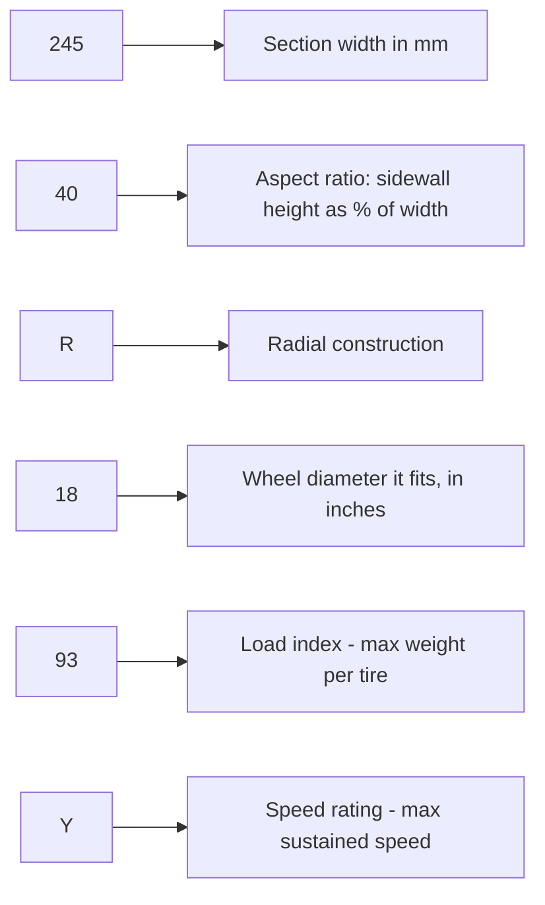

# Wheel & Tire Guide

## Design principle

Buy wheels and tires **once**, sized for the Phase 2 power target, not for the Phase 1
naturally-aspirated car in front of you. Re-buying wheels/tires after Phase 2 is one of the
most common budget overruns in builds like this.

> **📌 Note:** More torque needs more contact patch. A 500 hp street car on tires sized for
> a stock 300 hp car will struggle to put power down and will wear tires fast — see the
> sizing table below.

## Reading a tire sidewall (for first-timers)

Every tire has its full specification printed on the sidewall, in a format like
**245/40R18 93Y**. Here's what each part means:

| Code segment | Example | Meaning |
|---|---|---|
| Section width | 245 | Width of the tire in millimeters, measured sidewall to sidewall |
| Aspect ratio | 40 | Sidewall height as a percentage of the section width (lower = shorter, stiffer sidewall) |
| Construction | R | Radial (essentially universal on modern tires) |
| Wheel diameter | 18 | The wheel diameter (inches) this tire is built for |
| Load index | 93 | A code number mapping to a maximum load per tire — higher number = more capacity |
| Speed rating | Y | A letter code for maximum sustained speed capability |

> **⚠️ Caution:** Never fit a tire with a lower load index or speed rating than the car's
> original equipment specification, especially once power increases — this isn't just a
> performance question, it's a safety margin question.

## Reading a wheel spec

A wheel is typically specified as, for example, **18x9.5 +35 5x114.3**:

| Code segment | Example | Meaning |
|---|---|---|
| Diameter | 18 | Wheel diameter in inches — must match the tire's wheel-diameter spec |
| Width | 9.5 | Wheel width in inches |
| Offset | +35 | Distance (mm) from the wheel's centerline to its mounting face — lower/negative numbers push the wheel outward, higher numbers tuck it inward |
| Bolt pattern | 5x114.3 | 5 lug holes on a 114.3mm diameter circle — must match the car's hub exactly |

> **📌 Note for beginners:** Offset is the single most common source of "why is my wheel
> rubbing" surprises. Two wheels that are otherwise identical in diameter and width can fit
> completely differently if their offset numbers differ — always confirm offset against your
> specific suspension setup, not just against "what looked right in a photo."

## Sizing guidance by power level

| Power target | Recommended front tire width | Recommended rear tire width | Notes |
|---|---|---|---|
| Stock (~300 hp) | 225mm | 245mm | Factory-typical sizing |
| ~400 hp | 235–245mm | 265–275mm | Comfortable margin for moderate boost |
| ~500 hp (this build's target) | 245–255mm | 275–295mm | Matches this book's Phase 2 target |
| 550+ hp | 255–265mm | 295–315mm | Beyond this book's scope, included for reference |

> **💡 Tip:** Staggered width (narrower front, wider rear) suits this RWD, power-focused
> build better than a square setup — the rear needs the contact patch, the front needs to
> stay light and responsive.

## Wheel selection considerations

| Factor | Why it matters |
|---|---|
| Diameter | 18"–19" is the sweet spot — enough brake clearance for the [Brake Guide](#brake-guide) upgrade path without excessive unsprung weight |
| Width | Match to the tire sizing table above; check backspacing/offset against fender clearance |
| Weight | Lighter wheels reduce unsprung mass — improves both handling and, marginally, acceleration |
| Load rating | Must exceed the car's corner weight with margin, especially once driven hard |
| Offset | Confirm no rubbing at full steering lock and full suspension compression once lowered — see [Suspension Guide](#suspension-guide) |

## Tire selection considerations

| Use case | Tire category | Trade-off |
|---|---|---|
| Daily street, all-weather capable | Ultra-high-performance all-season | Best all-around; less outright grip |
| Street + occasional spirited driving (this build's default) | Max-performance summer | Excellent dry/wet grip, no snow capability |
| Street + track days | Track-oriented summer / 200TW | Best grip, faster wear, shorter tread life |

> **⚠️ Caution:** A 500 hp street car deserves tires with a real traction-control-off
> torque management plan in the tune (see [Phase 2](#phase-2-the-500-hp-plan)) — no tire
> compound alone makes 500 hp fully manageable in the wet on cold tires.

## Checking tread depth without a gauge

> **💡 Tip: the "penny test"** — insert a penny into the tread groove, Lincoln's head
> pointing down. If you can see all of Lincoln's head, the tread is at or below the legal
> minimum in most regions and the tire needs replacing. A quarter (with Washington's head)
> gives an earlier warning at a more conservative depth, useful for a performance tire you
> want replaced well before the legal minimum.

## Diagnosing tire wear patterns

> **📌 Note:** Uneven wear is the tire literally showing you a suspension or alignment
> problem — read it before you just replace the tire and repeat the problem.

| Wear pattern | Likely cause |
|---|---|
| Even wear across the whole tread | Normal — alignment and pressure are correct |
| Wear concentrated on the outer edge | Excessive negative camber, or consistently hard cornering |
| Wear concentrated on the inner edge | Insufficient negative camber for the driving style, or a toe issue |
| Wear in the center of the tread only | Overinflated tire |
| Wear on both outer edges, center still deep | Underinflated tire |
| Cupping / scalloped wear pattern | Worn shocks/dampers failing to control the tire's motion |
| Feathering (one edge of each tread block worn more than the other) | Toe misalignment |

## Fitment checklist

> **✅ Checklist**
> - [ ] Confirm wheel offset/backspacing against fender clearance at ride height
> - [ ] Test full steering lock (both directions) for rubbing, at Phase 1 ride height
> - [ ] Test full suspension compression (bounce test or ramp) for rubbing
> - [ ] Confirm TPMS sensor compatibility if changing from OE wheels
> - [ ] Torque lug nuts to spec (see [Maintenance Guide](#maintenance-guide)) and re-torque
>   after first 50–100 miles
> - [ ] Balance all four wheels/tires before first drive

## Alignment targets (starting point — tune to preference)

| Angle | Front | Rear | Notes |
|---|---|---|---|
| Camber | -1.0° to -2.0° | -1.0° to -1.5° | More negative for spirited/track use, less for even daily tire wear |
| Toe | Slightly toe-out to 0 | Slightly toe-in | Improves turn-in without excessive tire wear |
| Caster | Maximum available | N/A | Improves high-speed stability and steering feel |

> **📌 Note:** Finalize alignment after the [Suspension Guide](#suspension-guide) coilover
> install and after the suspension has settled (100–200 miles) — aligning before settling
> wastes the alignment.

## Tire pressure basics

> **✅ Checklist**
> - [ ] Check pressure cold — before driving, or at least 3 hours after driving
> - [ ] Use the door jamb sticker spec as the baseline, not the tire's sidewall maximum
> - [ ] Adjust slightly upward (a few psi) for consistent track/spirited use, back to sticker
>   spec for daily driving
> - [ ] Recheck monthly — tires lose roughly 1 psi per month naturally, more with temperature swings

## Seasonal tire storage (if running dedicated summer/track tires)

> **💡 Tips**
> - Store tires indoors, away from direct sunlight and ozone sources (like running electric motors)
> - Store standing up if only for a short period, stacked or hung if long-term
> - Bag them if possible to slow rubber drying/cracking
> - Mark each tire's position (LF/RF/LR/RR) before removal so they can go back in the same
>   rotation if partially worn

## Frequently asked questions

> **Q: Can I run different tire brands front vs. rear?**
> It's generally better to match brand/model per axle at minimum (all four ideally), since
> different tires can have meaningfully different grip characteristics — mismatched grip
> front-to-rear can create unpredictable handling, especially at the limit.

> **Q: Do I need to buy new tires every time I get an alignment?**
> No — alignment doesn't require new tires. It's the reverse relationship that matters:
> incorrect alignment wears tires unevenly and prematurely, so get aligned promptly after any
> suspension work (see the [Suspension Guide](#suspension-guide)) to protect the tires you have.

> **Q: My wheels look fine in photos — do I still need to check clearance in person?**
> Yes. Photos can't show clearance at full steering lock or full suspension travel, and
> offset numbers alone don't guarantee fitment on a lowered/modified suspension — always
> physically verify per the fitment checklist above.
