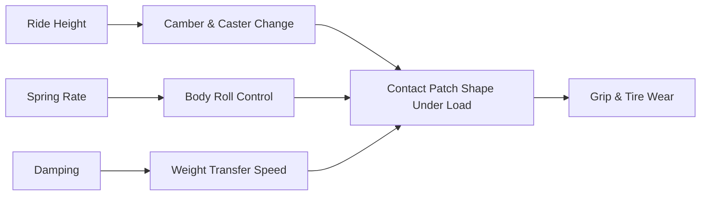

# Suspension Guide

## Goal

A suspension setup that makes 500 hp usable on real roads — predictable at the limit,
comfortable enough to daily, and adjustable enough to dial in as the car evolves.

## Recommended Phase 1 suspension package

| Component | Recommendation | Why |
|---|---|---|
| Coilovers | Street/spirited-driving valving (not full race spring rates) | Full race setups ride too harshly for a daily-driven street car and don't flatter this build's goals |
| Front lower control arm bushings | Replace with fresh OE-spec or performance polyurethane | Common wear point; directly affects steering precision |
| Sway bars (front + rear) | Adjustable, moderate stiffness increase over stock | Tunable understeer/oversteer balance without going full race stiff |
| Sway bar end links | Replace as a matter of course when doing sway bars | Cheap insurance, commonly worn/deformed |
| Strut tower brace (front, and rear if available) | Recommended | Reduces chassis flex, sharpens steering response |
| Alignment + corner balance | After settling | See [Wheel & Tire Guide](#wheel--tire-guide) for target angles |

> **💡 Tip:** Corner balancing (adjusting each corner's ride height/spring perch so weight
> distribution across all four corners is even) is often skipped on street builds but meaningfully
> improves how consistent the car feels turn-in to turn-in, especially once power increases.

## Suspension geometry basics

## Spring rate and damping guidance

| Use case | Spring rate feel | Damping setting starting point |
|---|---|---|
| Daily-focused street | Softer, more compliant | Mid-range damping, softer compression |
| Balanced street/spirited (this build's default) | Moderate stiffness | Mid-to-firm compression, firmer rebound |
| Track-focused | Stiff | Firm across the board — outside this book's default scope |

> **⚠️ Caution:** Going too stiff on a street car that also needs to put 500 hp down through
> real-world bumpy pavement can hurt traction as much as help handling — a tire that's
> hopping over bumps isn't gripping. Tune toward "balanced," not "stiffest available."

## Coilover install checklist

> **✅ Checklist**
> - [ ] Confirm coilover kit is specifically listed for 2005–2006 350Z (chassis-specific
>   spring perches and mounts)
> - [ ] Set ride height to a starting point (not lowest setting) — you can always lower
>   further after evaluating clearance and ride quality
> - [ ] Torque all suspension fasteners to spec (see [Maintenance Guide](#maintenance-guide))
> - [ ] Check for any rubbing at full lock/full compression before driving (see
>   [Wheel & Tire Guide](#wheel--tire-guide) fitment checklist)
> - [ ] Drive 100–200 miles to let the suspension settle before final alignment
> - [ ] Schedule alignment + corner balance
> - [ ] Re-torque all suspension fasteners after the settling drive

## Ride height vs. clearance trade-off

| Ride height | Handling benefit | Real-world cost |
|---|---|---|
| Stock height | None realized | Best ground clearance, easiest daily use |
| Moderate lowering (this build's default) | Lower center of gravity, sharper turn-in | Watch for speed bump/driveway clearance |
| Aggressive lowering | Maximum handling benefit on smooth surfaces | Frequent scraping, bump steer risk, poor daily usability |

> **📌 Note:** For a genuinely street-driven 500 hp car, moderate lowering is the right
> answer — see the [Project Vision](#project-vision) non-negotiable on street-driven
> manners.

## Maintenance interval for suspension components

| Component | Inspect every | Notes |
|---|---|---|
| Bushings | 20,000–30,000 mi or annually | Look for cracking, tearing, excessive play |
| Sway bar end links | 20,000–30,000 mi | Common clunk source when worn |
| Coilover seals/dampers | Annually or if ride quality degrades | Leaking damper fluid = replace/rebuild |
| Alignment | After any suspension work, then annually | More often if curb strikes or pothole impacts occur |
