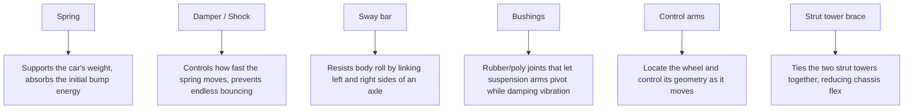
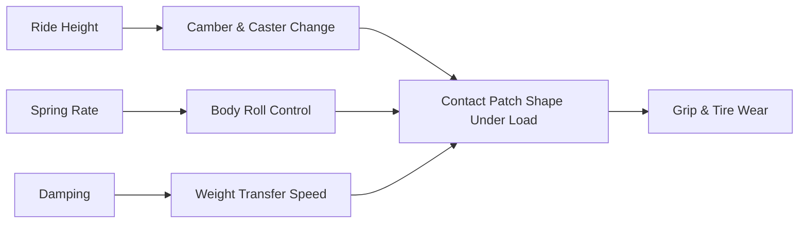

# Suspension Guide

## Goal

A suspension setup that makes 500 hp usable on real roads — predictable at the limit,
comfortable enough to daily, and adjustable enough to dial in as the car evolves.

## For first-timers: what each suspension part actually does

| Part | Plain-English job | What happens when it wears out |
|---|---|---|
| Spring | Holds the car's weight up, compresses over bumps | Sags, ride height drops, handling gets vague |
| Damper/shock | Slows the spring's motion so it doesn't just keep bouncing | Car floats/bounces after bumps, poor tire contact |
| Sway bar | Reduces body lean in corners by resisting one side rolling more than the other | Increased body roll, less predictable cornering |
| Bushings | Cushion and allow controlled movement where suspension arms pivot | Clunks, vague/wandering steering, uneven tire wear |
| Control arms | Hold the wheel at the correct geometry through suspension travel | Alignment changes unpredictably, potential safety issue if failed |

## Understeer vs. oversteer (plain English)

> **📌 Note:** You'll see these terms in any suspension discussion — here's what they mean
> without the racing jargon.

- **Understeer**: the front of the car wants to go straight even as you turn the wheel more —
  it feels like the car is "pushing" wide of the turn. Most street cars (including a stock
  350Z) are tuned toward mild understeer because it's more forgiving for an average driver.
- **Oversteer**: the rear of the car wants to swing wider than the front — it feels like the
  back end is trying to overtake the front through a turn. More power to the rear wheels
  (like this build's Phase 2 plan) increases the potential for oversteer if the suspension
  and tires aren't set up to manage it.

This book's suspension recommendations aim for a balanced, mildly understeer-biased setup —
predictable for a street car carrying real power, not a twitchy track-only setup.

## Recommended Phase 1 suspension package

| Component | Recommendation | Why |
|---|---|---|
| Coilovers | Street/spirited-driving valving (not full race spring rates) | Full race setups ride too harshly for a daily-driven street car and don't flatter this build's goals |
| Front lower control arm bushings | Replace with fresh OE-spec or performance polyurethane | Common wear point; directly affects steering precision |
| Sway bars (front + rear) | Adjustable, moderate stiffness increase over stock | Tunable understeer/oversteer balance without going full race stiff |
| Sway bar end links | Replace as a matter of course when doing sway bars | Cheap insurance, commonly worn/deformed |
| Strut tower brace (front, and rear if available) | Recommended | Reduces chassis flex, sharpens steering response |
| Alignment + corner balance | After settling | See [Wheel & Tire Guide](#wheel--tire-guide) for target angles |

> **💡 Tip:** Corner balancing (adjusting each corner's ride height/spring perch so weight
> distribution across all four corners is even) is often skipped on street builds but meaningfully
> improves how consistent the car feels turn-in to turn-in, especially once power increases.

## Suspension geometry basics

## Spring rate and damping guidance

| Use case | Spring rate feel | Damping setting starting point |
|---|---|---|
| Daily-focused street | Softer, more compliant | Mid-range damping, softer compression |
| Balanced street/spirited (this build's default) | Moderate stiffness | Mid-to-firm compression, firmer rebound |
| Track-focused | Stiff | Firm across the board — outside this book's default scope |

> **⚠️ Caution:** Going too stiff on a street car that also needs to put 500 hp down through
> real-world bumpy pavement can hurt traction as much as help handling — a tire that's
> hopping over bumps isn't gripping. Tune toward "balanced," not "stiffest available."

## DIY vs. shop for suspension work

| Job | DIY-friendly? | Notes |
|---|---|---|
| Coilover install | Moderate — needs a spring compressor and correct torque tools | Getting the top mount/camber plate orientation wrong is a common mistake |
| Bushing replacement | Moderate-hard | Often needs a press; heat/penetrating fluid helps with old, seized bushings |
| Sway bar end link replacement | Yes | Straightforward with basic tools |
| Strut tower brace install | Yes | Bolt-on in most cases |
| Alignment | No | Requires an alignment rack for accurate results |
| Corner balancing | No | Requires a corner-weight scale setup |

## How to check your existing shocks/dampers yourself (bounce test)

> **✅ Checklist**
> - [ ] Push down firmly on one corner of the car and release
> - [ ] A healthy damper lets the car settle after one, maybe two gentle bounces
> - [ ] Continued bouncing (more than 2 cycles) suggests a worn/failing damper
> - [ ] Repeat at all four corners and compare — one corner behaving very differently from
>   the others is a clear sign

## Coilover install checklist

> **✅ Checklist**
> - [ ] Confirm coilover kit is specifically listed for 2005–2006 350Z (chassis-specific
>   spring perches and mounts)
> - [ ] Set ride height to a starting point (not lowest setting) — you can always lower
>   further after evaluating clearance and ride quality
> - [ ] Torque all suspension fasteners to spec (see [Maintenance Guide](#maintenance-guide))
> - [ ] Check for any rubbing at full lock/full compression before driving (see
>   [Wheel & Tire Guide](#wheel--tire-guide) fitment checklist)
> - [ ] Drive 100–200 miles to let the suspension settle before final alignment
> - [ ] Schedule alignment + corner balance
> - [ ] Re-torque all suspension fasteners after the settling drive

## Ride height vs. clearance trade-off

| Ride height | Handling benefit | Real-world cost |
|---|---|---|
| Stock height | None realized | Best ground clearance, easiest daily use |
| Moderate lowering (this build's default) | Lower center of gravity, sharper turn-in | Watch for speed bump/driveway clearance |
| Aggressive lowering | Maximum handling benefit on smooth surfaces | Frequent scraping, bump steer risk, poor daily usability |

> **📌 Note:** For a genuinely street-driven 500 hp car, moderate lowering is the right
> answer — see the [Project Vision](#project-vision) non-negotiable on street-driven
> manners.

## Maintenance interval for suspension components

| Component | Inspect every | Notes |
|---|---|---|
| Bushings | 20,000–30,000 mi or annually | Look for cracking, tearing, excessive play |
| Sway bar end links | 20,000–30,000 mi | Common clunk source when worn |
| Coilover seals/dampers | Annually or if ride quality degrades | Leaking damper fluid = replace/rebuild |
| Alignment | After any suspension work, then annually | More often if curb strikes or pothole impacts occur |

## Frequently asked questions

> **Q: How do I know if I should adjust damping stiffer or softer?**
> If the car feels floaty/wallowy over bumps or under hard braking, go firmer. If the ride
> feels harsh, jittery, or the tires seem to skip over small bumps rather than absorb them,
> go softer. Change one setting at a time and drive the same road each time to compare fairly.

> **Q: Do I need adjustable coilovers, or is a fixed setup fine?**
> Adjustable ride height (nearly all coilovers offer this) is worth having for fitment
> flexibility. Adjustable damping is a nice-to-have for this build's goals, not a requirement —
> a well-chosen fixed-valving street/spirited setup can work fine if damping adjustment isn't
> in budget.

> **Q: Is corner balancing really worth the extra cost for a street car?**
> It's optional but genuinely noticeable, especially once power increases — an unevenly
> balanced car can feel like it handles differently turning one direction versus the other.
> If budget is tight, prioritize the alignment itself first and add corner balancing later.
