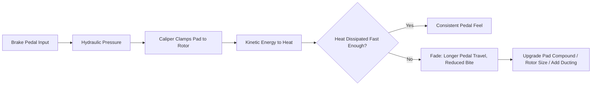

# Brake Guide

## Goal

Braking performance that scales with the power plan — by the time Phase 2 lands 500 hp,
the brakes should already have margin, not be playing catch-up.

> **🛑 Critical:** Braking upgrades are Phase 1, not Phase 2. Stopping power should always
> lead power, never follow it.

## Sizing guidance by power level

| Power target | Recommended front brake spec | Recommended rear brake spec | Notes |
|---|---|---|---|
| Stock (~300 hp) | Stock or factory Brembo (Grand Touring/Track) | Stock or factory Brembo | Adequate for factory power |
| ~400 hp | Factory Brembo or equivalent big-brake kit, quality street pads | Stock or lightly upgraded | Upgrade pads/fluid at minimum |
| ~500 hp (this build's target) | Big-brake kit — larger rotor + multi-piston caliper | Upgraded rotor/pad, stainless lines | Matches this book's Phase 2 target |
| Track-focused beyond this build | Race-spec big-brake kit, high-temp fluid, ducting | Matched race-spec rear | Outside this book's default scope |

> **💡 Tip:** If your car is a Grand Touring trim with factory Brembo brakes (see
> [Buyer's Guide](#the-350z-buyers-guide)), you may only need pads, rotors, and fluid rather
> than a full big-brake kit — real budget savings.

## Brake system components explained

| Component | Function | Upgrade priority for this build |
|---|---|---|
| Rotors | Provide the friction surface | High — size for the power target above |
| Pads | Provide the friction material against the rotor | High — match compound to street + spirited use |
| Calipers | Clamp the pads against the rotor | Medium — only needed if pursuing a big-brake kit |
| Brake lines | Carry hydraulic pressure from pedal to caliper | High — stainless lines resist swelling, firm up pedal feel |
| Brake fluid | Transmits hydraulic pressure; resists boiling under heat | High — cheap, critical, easy to defer by mistake |
| Master cylinder | Converts pedal force into hydraulic pressure | Low — stock unit usually adequate at this power level |

## Pad compound guide

| Use case | Compound category | Trade-off |
|---|---|---|
| Daily-focused street | Ceramic/street compound | Low dust, quiet, gentle on rotors; fades sooner under sustained hard use |
| Street + spirited driving (this build's default) | Street/track blend semi-metallic | Good bite when cold, resists fade better, slightly more dust/noise |
| Track-focused | Full track compound | Best fade resistance at temperature; poor cold bite, dusty, noisy — not ideal daily |

## Braking system heat management

> **⚠️ Caution:** Brake fade under repeated hard stops is a heat management problem, not a
> "need more brake" problem in isolation — pad compound, rotor mass, and cooling airflow all
> factor in before jumping straight to a bigger kit.

## Install & inspection checklist

> **✅ Checklist**
> - [ ] Bed in new pads/rotors per the pad manufacturer's procedure before hard use
> - [ ] Torque caliper bracket bolts and wheel lug nuts to spec (see
>   [Maintenance Guide](#maintenance-guide))
> - [ ] Bleed the full system with fresh high-temp fluid — bench bleed new calipers before
>   install if applicable
> - [ ] Confirm no fluid leaks at banjo bolts/fittings after initial bleed
> - [ ] Check pedal feel is firm, not spongy, before driving
> - [ ] Re-torque wheels after first 50–100 miles
> - [ ] Inspect pad thickness and rotor condition every 3,000–5,000 miles once boosted (see
>   [Maintenance Guide](#maintenance-guide))

## Brake fluid — don't skip this

> **🛑 Critical:** Brake fluid is hygroscopic — it absorbs moisture over time, which lowers
> its boiling point. A car that's about to see real speed and real stopping demand deserves
> fresh, high-temp-rated fluid (DOT 4 or better) on a 1-year interval, not the 2-year stock
> interval. See [Maintenance Guide](#maintenance-guide).

