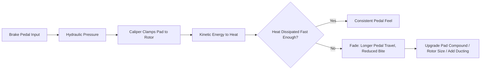

# Brake Guide

## Goal

Braking performance that scales with the power plan — by the time Phase 2 lands 500 hp,
the brakes should already have margin, not be playing catch-up.

> **🛑 Critical:** Braking upgrades are Phase 1, not Phase 2. Stopping power should always
> lead power, never follow it.

## How the brake system actually works (for first-timers)

Every component in this chapter exists to make one of those five steps work better under
more demanding conditions (higher speed, higher weight-transfer, repeated hard stops) than
the stock system was designed for.

## Sizing guidance by power level

| Power target | Recommended front brake spec | Recommended rear brake spec | Notes |
|---|---|---|---|
| Stock (~300 hp) | Stock or factory Brembo (Grand Touring/Track) | Stock or factory Brembo | Adequate for factory power |
| ~400 hp | Factory Brembo or equivalent big-brake kit, quality street pads | Stock or lightly upgraded | Upgrade pads/fluid at minimum |
| ~500 hp (this build's target) | Big-brake kit — larger rotor + multi-piston caliper | Upgraded rotor/pad, stainless lines | Matches this book's Phase 2 target |
| Track-focused beyond this build | Race-spec big-brake kit, high-temp fluid, ducting | Matched race-spec rear | Outside this book's default scope |

> **💡 Tip:** If your car is a Grand Touring trim with factory Brembo brakes (see
> [Buyer's Guide](#the-350z-buyers-guide)), you may only need pads, rotors, and fluid rather
> than a full big-brake kit — real budget savings.

## Brake system components explained

| Component | Function | Upgrade priority for this build |
|---|---|---|
| Rotors | Provide the friction surface | High — size for the power target above |
| Pads | Provide the friction material against the rotor | High — match compound to street + spirited use |
| Calipers | Clamp the pads against the rotor | Medium — only needed if pursuing a big-brake kit |
| Brake lines | Carry hydraulic pressure from pedal to caliper | High — stainless lines resist swelling, firm up pedal feel |
| Brake fluid | Transmits hydraulic pressure; resists boiling under heat | High — cheap, critical, easy to defer by mistake |
| Master cylinder | Converts pedal force into hydraulic pressure | Low — stock unit usually adequate at this power level |

## Pad compound guide

| Use case | Compound category | Trade-off |
|---|---|---|
| Daily-focused street | Ceramic/street compound | Low dust, quiet, gentle on rotors; fades sooner under sustained hard use |
| Street + spirited driving (this build's default) | Street/track blend semi-metallic | Good bite when cold, resists fade better, slightly more dust/noise |
| Track-focused | Full track compound | Best fade resistance at temperature; poor cold bite, dusty, noisy — not ideal daily |

## Brake fluid types explained (DOT 3 vs. 4 vs. 5.1)

> **📌 Note for beginners:** Higher DOT numbers generally mean a higher boiling point, which
> matters because brake fluid heats up under hard/repeated braking — a fluid boiling in the
> line turns to compressible gas bubbles, which is what causes a sudden spongy pedal or
> total brake fade under hard use.

| Type | Typical dry boiling point | Notes |
|---|---|---|
| DOT 3 | Lowest of the common types | Factory-spec on many cars, adequate for light use only |
| DOT 4 | Higher than DOT 3 | Recommended minimum for this build |
| DOT 5.1 | Higher still, glycol-based like DOT 3/4 | Best all-around choice for spirited street/occasional track use |
| DOT 5 | High boiling point but silicone-based | **Do not mix with DOT 3/4/5.1** — different chemistry, incompatible; not recommended for this build |

> **🛑 Critical:** Never mix DOT 5 (silicone) fluid with DOT 3/4/5.1 (glycol-based) fluid —
> they don't mix properly and can cause seal damage or brake failure. Stick to one glycol-based
> type and flush fully when changing types.

## Braking system heat management

> **⚠️ Caution:** Brake fade under repeated hard stops is a heat management problem, not a
> "need more brake" problem in isolation — pad compound, rotor mass, and cooling airflow all
> factor in before jumping straight to a bigger kit.

## How to bed in new brakes (step by step)

> **✅ Checklist — always bed new pads/rotors before hard driving**
> - [ ] Find a safe, empty stretch of road with no traffic behind you
> - [ ] Perform 6–10 moderate stops from around 40–50 mph down to about 15 mph, accelerating
>   back up between each, without coming to a complete stop
> - [ ] Follow with a slow drive for a few minutes to let everything cool gradually — do not
>   come to a complete stop and sit immediately after the bedding stops (this can transfer
>   pad material unevenly onto the hot rotor and cause a pulsation)
> - [ ] Avoid hard braking for the first 100–200 miles beyond the bedding procedure while
>   everything fully cures
> - [ ] Always follow the specific pad manufacturer's bedding procedure if it differs from
>   the general guidance above — it varies by compound

## How to check pad thickness through the wheel yourself

> **💡 Tip:** With the wheel still on, look through the gaps in the spokes at the caliper —
> you should be able to see the pad material against the rotor. Compare thickness side to
> side; a pad that looks like a thin sliver compared to a fresh one (or compared to the other
> side) needs replacement soon. When in doubt, pull the wheel for a clear look, or have a
> shop check during a routine service.

## A beginner's guide to bleeding brakes

> **📌 Note:** This is a moderate-difficulty DIY job — doable solo with a one-way bleeder
> valve tool, easier with a second person pressing the pedal on your call.

> **✅ Checklist**
> - [ ] Start with the wheel farthest from the master cylinder (typically passenger rear),
>   finish with the closest (typically driver front) — check your FSM for the exact order
> - [ ] Keep the fluid reservoir topped up throughout — letting it run dry introduces air
>   into the whole system and means starting over
> - [ ] Open the bleeder screw, have your helper slowly press the pedal, close the screw
>   before they release it, repeat until the fluid runs clear with no bubbles
> - [ ] Confirm firm pedal feel before driving — a soft/spongy pedal means air remains

## Install & inspection checklist

> **✅ Checklist**
> - [ ] Bed in new pads/rotors per the pad manufacturer's procedure before hard use
> - [ ] Torque caliper bracket bolts and wheel lug nuts to spec (see
>   [Maintenance Guide](#maintenance-guide))
> - [ ] Bleed the full system with fresh high-temp fluid — bench bleed new calipers before
>   install if applicable
> - [ ] Confirm no fluid leaks at banjo bolts/fittings after initial bleed
> - [ ] Check pedal feel is firm, not spongy, before driving
> - [ ] Re-torque wheels after first 50–100 miles
> - [ ] Inspect pad thickness and rotor condition every 3,000–5,000 miles once boosted (see
>   [Maintenance Guide](#maintenance-guide))

## Brake fluid — don't skip this

> **🛑 Critical:** Brake fluid is hygroscopic — it absorbs moisture over time, which lowers
> its boiling point. A car that's about to see real speed and real stopping demand deserves
> fresh, high-temp-rated fluid (DOT 4 or better) on a 1-year interval, not the 2-year stock
> interval. See [Maintenance Guide](#maintenance-guide).

## Frequently asked questions

> **Q: Do I need a big brake kit if I'm not planning to track the car?**
> Not necessarily — quality pads, fresh fluid, and stainless lines on the stock (or factory
> Brembo) hardware can be adequate for street + occasional spirited driving up to roughly the
> ~400 hp row in the sizing table. A full big-brake kit becomes more important as you
> approach this book's 500 hp target and the car's weight-transfer under harder braking increases.

> **Q: Why do my brakes feel great cold but fade after a few hard stops?**
> That's a textbook heat management issue — see the heat management diagram above. Start
> with a better pad compound and fresh fluid before assuming you need bigger rotors/calipers.

> **Q: Is it normal for new pads to feel worse than the old ones initially?**
> Yes, briefly — new pads need the bedding procedure above to transfer an even layer of pad
> material onto the rotor before they reach full effectiveness. Expect a slightly different
> (not worse, just different) pedal feel during the first 100–200 miles.
