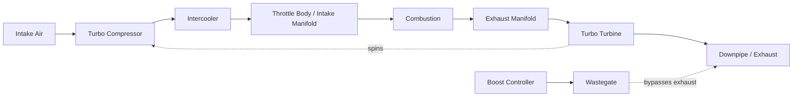

# Turbo Planning Guide

## Why single-turbo, moderate boost

This book's target — a **reliable** 500 hp street car — points toward a single-turbo,
moderate-boost setup over a twin-turbo factory-style layout for three reasons:

| Factor | Single-turbo, moderate boost | Twin-turbo |
|---|---|---|
| Cost | Lower — one turbo, simpler piping, less labor | Higher — two turbos, more piping/manifolds, more labor |
| Tuning complexity | Simpler — one set of maps to balance | More complex — cylinder bank balance matters |
| Packaging | More room for a larger, more efficient single turbo | Tighter packaging in a V6 bay, more heat soak |
| Reliability at this power level | Excellent — well within a quality single turbo's efficient range | Also reliable, but the cost/complexity isn't justified at 500 hp specifically |

> **📌 Note:** Twin-turbo setups make more sense either at significantly higher power targets
> or when preserving factory manifold packaging is a priority. At 500 hp, single-turbo is the
> more budget-efficient, easier-to-tune path — which is why [Phase 2](#phase-2-the-500-hp-plan)
> defaults to it.

## Turbo system flow

## Sizing the turbo to the target

| Turbo sizing factor | Guidance for ~500 whp target |
|---|---|
| Compressor size | Sized for efficient flow at the target power without excessive lag — oversizing hurts spool/drivability |
| Turbine housing A/R | Smaller A/R spools faster (better street manners), larger A/R flows more at high RPM — pick toward the "faster spool" side for a street car |
| Wastegate | Properly sized external wastegate recommended for consistent boost control at this power level |
| Boost target | 8–12 psi typical range to reach ~500 whp on this platform, depending on turbo efficiency and supporting mods — confirm with your tuner, not just a forum number |

> **⚠️ Caution:** "Bigger turbo" is not automatically "better turbo." A turbo sized well
> above the target power level spools later, feels laggy in daily driving, and doesn't serve
> this book's "reliable street car" goal. Size for the target, not for bragging rights.

## Fuel system sizing checklist

> **✅ Checklist**
> - [ ] Calculate required injector flow at target power + a safety margin (don't run
>   injectors at their absolute duty-cycle ceiling)
> - [ ] Confirm fuel pump flow rate supports target power at the required fuel pressure
> - [ ] Confirm fuel lines are not a bottleneck at the upgraded flow rate
> - [ ] Have the tuner confirm injector scaling/data is correctly programmed in the ECU/tune
>   before the first startup

> **🛑 Critical:** An undersized fuel system at the moment boost is increased is one of the
> fastest ways to damage an engine — a lean condition under load can cause detonation and
> catastrophic engine failure within seconds. This is not an area to cut cost.

## Supporting hardware checklist

> **✅ Checklist**
> - [ ] Intercooler sized to control intake air temperature across repeated pulls, not just
>   a single dyno run
> - [ ] Intercooler piping routed to avoid sharp bends that restrict flow
> - [ ] Downpipe and exhaust diameter matched to turbo housing flow capacity
> - [ ] Oil feed line sized/restricted per turbo manufacturer spec; oil drain line has
>   adequate downward slope to prevent oil backing up into the turbo center section
> - [ ] Coolant lines to turbo center section connected if the turbo is water-cooled
> - [ ] Boost controller installed with a safe, conservative default/failsafe boost level
> - [ ] Wideband AFR sensor installed and logged/visible at all times

## Ignition & knock management

| Consideration | Why it matters at this power level |
|---|---|
| Spark plug heat range | Colder plugs recommended once boosted — see [Maintenance Guide](#maintenance-guide) |
| Ignition timing | Reduced/retarded from N/A baseline under boost to manage knock risk — tuner's call, not a DIY guess |
| Knock sensor monitoring | Must be active and logged on every tuning pull — knock is the earliest warning sign of a problem |
| Fuel octane | Higher-octane fuel (or a flex-fuel/ethanol blend approach, if pursued) increases the safe timing/boost window |

## Tuning process checklist

> **✅ Checklist — see also [Phase 2](#phase-2-the-500-hp-plan) build order**
> - [ ] Start with a conservative, low-boost safe baseline tune and road test before any
>   aggressive dyno pulls
> - [ ] Progressive boost increase across multiple dyno pulls, not one jump to target boost
> - [ ] Full AFR trace reviewed on every pull — no sustained lean spikes under load
> - [ ] Knock/timing retard trace reviewed on every pull — persistent knock means back off
>   boost/timing, not push through it
> - [ ] Transmission temps monitored during dyno session, not just engine parameters (see
>   [Maintenance Guide](#maintenance-guide))
> - [ ] Final tune validated with a street-driving data log, not just the dyno session alone
> - [ ] Tune file and full dyno sheets saved — physical and digital copy

## Common turbo-build mistakes this book is designed to avoid

> **⚠️ Caution — avoid these**
> - Buying turbo hardware before the transmission and brakes are sorted (see
>   [Phase 1](#phase-1-build-plan))
> - Undersizing the fuel system "to save money" and finding out on the dyno
> - Skipping the auxiliary transmission cooler because it "should be fine"
> - Chasing a bigger turbo than the target power needs, sacrificing street drivability
> - Treating the initial tune as final instead of scheduling the follow-up session (see
>   [Phase 2](#phase-2-the-500-hp-plan))
