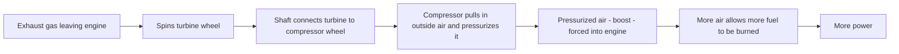
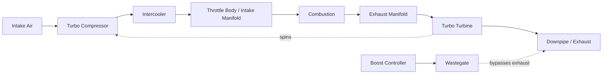
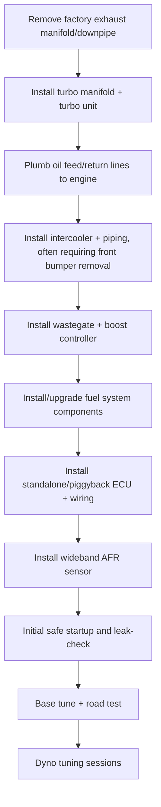

# Turbo Planning Guide

## What a turbo actually does (for absolute first-timers)

A naturally aspirated engine only breathes in as much air as atmospheric pressure and its
own pistons can pull in on their own. A turbocharger uses the engine's own exhaust gas —
which would otherwise just be wasted heat and pressure heading out the tailpipe — to spin a
turbine, which spins a connected compressor wheel that force-feeds extra air into the
engine. More air in means more fuel can be burned with it, which means more power.

> **📌 Note:** This is why a turbo is sometimes called "free power" compared to a
> supercharger (which is belt-driven directly off the engine, costing some power to spin
> it) — a turbo runs off exhaust energy that would otherwise be wasted. The trade-off is
> **turbo lag**: a brief delay between pressing the throttle and the turbo spinning up
> enough exhaust flow to make meaningful boost, since it takes a moment for exhaust flow to
> build after you ask for more power.

## Why single-turbo, moderate boost

This book's target — a **reliable** 500 hp street car — points toward a single-turbo,
moderate-boost setup over a twin-turbo factory-style layout for three reasons:

| Factor | Single-turbo, moderate boost | Twin-turbo |
|---|---|---|
| Cost | Lower — one turbo, simpler piping, less labor | Higher — two turbos, more piping/manifolds, more labor |
| Tuning complexity | Simpler — one set of maps to balance | More complex — cylinder bank balance matters |
| Packaging | More room for a larger, more efficient single turbo | Tighter packaging in a V6 bay, more heat soak |
| Reliability at this power level | Excellent — well within a quality single turbo's efficient range | Also reliable, but the cost/complexity isn't justified at 500 hp specifically |

> **📌 Note:** Twin-turbo setups make more sense either at significantly higher power targets
> or when preserving factory manifold packaging is a priority. At 500 hp, single-turbo is the
> more budget-efficient, easier-to-tune path — which is why [Phase 2](#phase-2-the-500-hp-plan)
> defaults to it.

## Turbo system flow

## Turbo system vocabulary, in plain English

| Term | Plain-English definition |
|---|---|
| Turbine | The wheel spun directly by exhaust gas flow |
| Compressor | The wheel (on the same shaft as the turbine) that pressurizes incoming air |
| A/R ratio | A measurement of the turbine/compressor housing shape that affects how quickly exhaust energy spins the turbo — smaller generally spools faster, larger flows more at high RPM |
| Wastegate | A valve that bypasses some exhaust flow around the turbine, to control how much boost is made — prevents overboost |
| Blow-off/diverter valve (BOV) | A valve that releases pressurized air trapped between the turbo and a closing throttle body, preventing compressor surge/damage |
| Intercooler | A radiator-like heat exchanger that cools the compressed (and therefore hot) intake air before it enters the engine — cooler, denser air makes more power and resists knock |
| Boost controller | A device (manual or electronic) that manages wastegate behavior to hit a target boost level |
| Turbo lag | The delay between throttle input and the turbo producing meaningful boost |
| Spool | The turbo "spooling up" — building rotational speed and boost after a throttle input |
| Surge | A turbo compressor instability that happens when the throttle closes suddenly against built-up pressure — the BOV exists specifically to prevent this |

## Sizing the turbo to the target

| Turbo sizing factor | Guidance for ~500 whp target |
|---|---|
| Compressor size | Sized for efficient flow at the target power without excessive lag — oversizing hurts spool/drivability |
| Turbine housing A/R | Smaller A/R spools faster (better street manners), larger A/R flows more at high RPM — pick toward the "faster spool" side for a street car |
| Wastegate | Properly sized external wastegate recommended for consistent boost control at this power level |
| Boost target | 8–12 psi typical range to reach ~500 whp on this platform, depending on turbo efficiency and supporting mods — confirm with your tuner, not just a forum number |

> **⚠️ Caution:** "Bigger turbo" is not automatically "better turbo." A turbo sized well
> above the target power level spools later, feels laggy in daily driving, and doesn't serve
> this book's "reliable street car" goal. Size for the target, not for bragging rights.

## What a turbo kit installation actually involves (overview for first-timers)

> **📌 Note:** This is squarely a shop job (see [Maintenance Guide](#maintenance-guide)
> DIY-vs-shop table), but understanding the scope helps you evaluate quotes and timelines.

> **💡 Tip:** Ask your shop for a realistic labor-hours estimate for the full sequence above,
> not just "the turbo kit install" — fuel system and ECU wiring often take as long as the
> turbo hardware itself.

## Fuel system sizing checklist

> **✅ Checklist**
> - [ ] Calculate required injector flow at target power + a safety margin (don't run
>   injectors at their absolute duty-cycle ceiling)
> - [ ] Confirm fuel pump flow rate supports target power at the required fuel pressure
> - [ ] Confirm fuel lines are not a bottleneck at the upgraded flow rate
> - [ ] Have the tuner confirm injector scaling/data is correctly programmed in the ECU/tune
>   before the first startup

> **🛑 Critical:** An undersized fuel system at the moment boost is increased is one of the
> fastest ways to damage an engine — a lean condition under load can cause detonation and
> catastrophic engine failure within seconds. This is not an area to cut cost.

## Supporting hardware checklist

> **✅ Checklist**
> - [ ] Intercooler sized to control intake air temperature across repeated pulls, not just
>   a single dyno run
> - [ ] Intercooler piping routed to avoid sharp bends that restrict flow
> - [ ] Downpipe and exhaust diameter matched to turbo housing flow capacity
> - [ ] Oil feed line sized/restricted per turbo manufacturer spec; oil drain line has
>   adequate downward slope to prevent oil backing up into the turbo center section
> - [ ] Coolant lines to turbo center section connected if the turbo is water-cooled
> - [ ] Boost controller installed with a safe, conservative default/failsafe boost level
> - [ ] Wideband AFR sensor installed and logged/visible at all times

## Ignition & knock management

| Consideration | Why it matters at this power level |
|---|---|
| Spark plug heat range | Colder plugs recommended once boosted — see [Maintenance Guide](#maintenance-guide) |
| Ignition timing | Reduced/retarded from N/A baseline under boost to manage knock risk — tuner's call, not a DIY guess |
| Knock sensor monitoring | Must be active and logged on every tuning pull — knock is the earliest warning sign of a problem |
| Fuel octane | Higher-octane fuel (or a flex-fuel/ethanol blend approach, if pursued) increases the safe timing/boost window |

## What is knock/detonation, really? (for first-timers)

> **📌 Note:** Normal combustion is a controlled flame front started by the spark plug at
> the right instant. Knock (detonation) happens when heat and pressure in the cylinder cause
> the fuel/air mixture to ignite on its own, uncontrolled, usually colliding with the normal
> flame front. The resulting pressure spike can physically damage pistons, rings, and
> head gaskets — often within seconds of sustained knock, not gradually over time. This is
> why every checklist in this chapter treats knock monitoring as non-negotiable.

## Tuning process checklist

> **✅ Checklist — see also [Phase 2](#phase-2-the-500-hp-plan) build order**
> - [ ] Start with a conservative, low-boost safe baseline tune and road test before any
>   aggressive dyno pulls
> - [ ] Progressive boost increase across multiple dyno pulls, not one jump to target boost
> - [ ] Full AFR trace reviewed on every pull — no sustained lean spikes under load
> - [ ] Knock/timing retard trace reviewed on every pull — persistent knock means back off
>   boost/timing, not push through it
> - [ ] Transmission temps monitored during dyno session, not just engine parameters (see
>   [Maintenance Guide](#maintenance-guide))
> - [ ] Final tune validated with a street-driving data log, not just the dyno session alone
> - [ ] Tune file and full dyno sheets saved — physical and digital copy

## Common turbo-build mistakes this book is designed to avoid

> **⚠️ Caution — avoid these**
> - Buying turbo hardware before the transmission and brakes are sorted (see
>   [Phase 1](#phase-1-build-plan))
> - Undersizing the fuel system "to save money" and finding out on the dyno
> - Skipping the auxiliary transmission cooler because it "should be fine"
> - Chasing a bigger turbo than the target power needs, sacrificing street drivability
> - Treating the initial tune as final instead of scheduling the follow-up session (see
>   [Phase 2](#phase-2-the-500-hp-plan))

## Frequently asked questions

> **Q: What's the difference between a "piggyback" and a "standalone" ECU?**
> A piggyback system intercepts and modifies signals to/from the factory ECU, leaving the
> factory computer in charge of most functions. A standalone ECU fully replaces the factory
> unit with complete, from-scratch tunability. Piggyback systems are often cheaper and less
> invasive; standalone systems offer more complete control, at higher cost and complexity.
> Your tuner's experience/preference on this platform should heavily inform the choice.

> **Q: How much turbo lag should I expect on a properly sized setup?**
> A well-sized single turbo for this book's target should spool noticeably but not
> unpleasantly — full boost within roughly a second or so of a hard throttle input from
> moderate RPM, not an abrupt on/off "light switch" delivery. If it feels dramatically
> laggier than that, revisit turbine sizing with your tuner.

> **Q: Can I run more boost than 12 psi if I want more than 500 hp?**
> You can, but at that point you're outside this book's specifically validated target and
> supporting-hardware sizing — higher boost needs proportionally larger supporting systems
> (fuel, intercooling, ignition) and likely revisits the transmission's margin too. Treat it
> as a new planning exercise, not just "turn up the boost controller."
