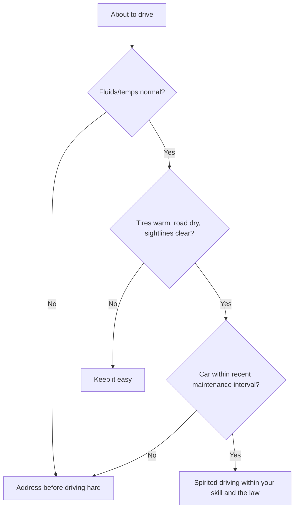

# Driving Rules

> **📌 Note:** These are the personal ground rules this build assumes you'll drive by. Adapt
> them, but read the reasoning — most of them exist to protect a specific part of the build.

## The rules

1. **Warm it up before you lean on it.** Give the engine, transmission, and tires a few
   minutes of easy driving before hard acceleration — especially in cold weather. Cold ATF
   and cold tires are both worse at their jobs.
2. **Cool it down before you shut it off.** After a hard run, a couple of minutes of easy
   driving lets turbo oil temps and transmission temps come down before oil circulation
   stops. Don't hard-pull into a parking lot and kill the engine.
3. **Watch the gauges, not just the speedometer.** Transmission temp and AFR/boost (if
   visible) matter as much as road speed once Phase 2 is installed — see
   [Maintenance Guide](#maintenance-guide).
4. **No launches/hard shifts until the transmission build is validated.** Confirm the
   [Phase 2](#phase-2-the-500-hp-plan) exit criteria are met before repeated hard launches
   become part of your driving habit.
5. **Respect the tune's failsafe boost level.** If the tune has a conservative default/
   failsafe boost setting for pump gas or unknown conditions, don't override it casually.
6. **One variable at a time.** Don't change tires, alignment, and tune in the same week and
   then try to evaluate how the car feels — you won't know which change did what.
7. **Log anything unusual immediately.** A weird noise, a flare in the transmission, a
   flicker of a warning light — write it in the [Maintenance Log](#maintenance-log) the same
   day, before you forget the details that matter for diagnosis.
8. **Street driving is not dyno driving.** Public roads have variable grip, traffic, and
   consequences a dyno doesn't — drive within what you can see and stop within, regardless
   of what the car is capable of.

## Street vs. spirited driving decision guide

## Warm-up / cool-down quick reference

| Condition | Warm-up before hard driving | Cool-down before shutoff |
|---|---|---|
| Warm weather, recently driven | 1–2 minutes easy driving | 1–2 minutes easy driving |
| Cold weather / cold start | 3–5 minutes easy driving | 2–3 minutes easy driving |
| After sustained hard driving (canyon run, track day) | N/A | 3–5 minutes easy driving minimum |

## Track/spirited day checklist

> **✅ Checklist — before any track day or dedicated spirited driving session**
> - [ ] Fluid levels checked same day (oil, coolant, transmission, brake)
> - [ ] Tire pressures set for the conditions/tire compound
> - [ ] Brake pad thickness visually confirmed (see [Brake Guide](#brake-guide))
> - [ ] Lug nuts confirmed torqued to spec
> - [ ] Wideband AFR / boost gauge confirmed functioning if data logging
> - [ ] Emergency contact and basic first aid/fire extinguisher in the car
> - [ ] Log the session afterward in the [Maintenance Log](#maintenance-log), noting any
>   anomalies

## Legal & safety baseline

> **🛑 Critical**
> - Obey posted speed limits and traffic laws on public roads — this book's "spirited
>   driving" assumes closed courses, track days, or legal, controlled conditions for
>   anything beyond normal street driving.
> - Confirm exhaust and emissions modifications comply with local/regional regulations
>   before installing.
> - Confirm insurance coverage reflects the modified state of the car once Phase 2 is
>   complete — an unreported 500 hp build can complicate a claim.
