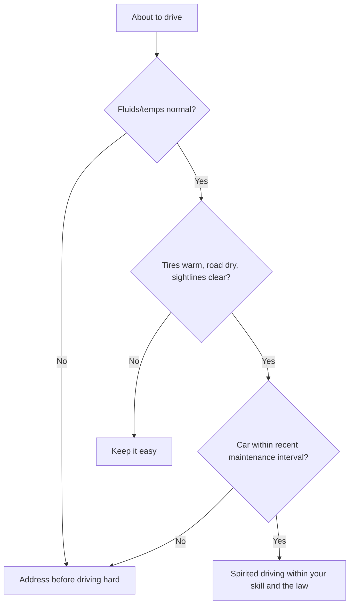

# Driving Rules

> **📌 Note:** These are the personal ground rules this build assumes you'll drive by. Adapt
> them, but read the reasoning — most of them exist to protect a specific part of the build.

## For first-timers: why a RWD, 500 hp car drives differently than what you're used to

If most of your driving experience is in a front-wheel-drive commuter car, a rear-wheel-drive
car with real power changes a few fundamentals worth understanding before you lean on it:

| What changes | Why |
|---|---|
| The rear wheels can lose traction under hard acceleration | All the power goes through two tires, not four — ask for more than they can grip and they spin instead of pushing the car forward |
| Weight shifts backward under acceleration, forward under braking | This is true of every car, but it matters more here — it changes how much grip the front vs. rear tires have moment to moment |
| The car can rotate (oversteer) if you get back on the throttle mid-corner | Sudden extra rear-wheel torque mid-turn can overwhelm rear grip — see the [Suspension Guide](#suspension-guide) understeer/oversteer explainer |
| Wet/cold conditions dramatically reduce the safe power you can actually use | Less available grip means the same throttle input that's fine on a warm, dry day can spin the tires on a cold, wet one |

> **💡 Tip:** None of this is a reason to be afraid of the car — it's a reason to build skill
> deliberately, the same way you'd budget money deliberately. See the skill-building path below.

## Building skill deliberately, not by accident

> **✅ Checklist — a sensible progression for a first powerful RWD car**
> - [ ] Spend real time driving the car stock/Phase-1 before Phase 2 power arrives — learn
>   its normal behavior as a baseline
> - [ ] Consider a professional performance driving school or autocross event — a controlled
>   environment is a far better place to learn the car's limits than a public road
> - [ ] Practice in an empty, legal, controlled space (like an autocross lot) before ever
>   exploring the car's limits on the street
> - [ ] Build up power exposure gradually as Phase 2 comes online — don't go from stock
>   straight to full boost on an unfamiliar road

## The rules

1. **Warm it up before you lean on it.** Give the engine, transmission, and tires a few
   minutes of easy driving before hard acceleration — especially in cold weather. Cold ATF
   and cold tires are both worse at their jobs.
2. **Cool it down before you shut it off.** After a hard run, a couple of minutes of easy
   driving lets turbo oil temps and transmission temps come down before oil circulation
   stops. Don't hard-pull into a parking lot and kill the engine.
3. **Watch the gauges, not just the speedometer.** Transmission temp and AFR/boost (if
   visible) matter as much as road speed once Phase 2 is installed — see
   [Maintenance Guide](#maintenance-guide).
4. **No launches/hard shifts until the transmission build is validated.** Confirm the
   [Phase 2](#phase-2-the-500-hp-plan) exit criteria are met before repeated hard launches
   become part of your driving habit.
5. **Respect the tune's failsafe boost level.** If the tune has a conservative default/
   failsafe boost setting for pump gas or unknown conditions, don't override it casually.
6. **One variable at a time.** Don't change tires, alignment, and tune in the same week and
   then try to evaluate how the car feels — you won't know which change did what.
7. **Log anything unusual immediately.** A weird noise, a flare in the transmission, a
   flicker of a warning light — write it in the [Maintenance Log](#maintenance-log) the same
   day, before you forget the details that matter for diagnosis.
8. **Street driving is not dyno driving.** Public roads have variable grip, traffic, and
   consequences a dyno doesn't — drive within what you can see and stop within, regardless
   of what the car is capable of.

## Street vs. spirited driving decision guide

## Warm-up / cool-down quick reference

| Condition | Warm-up before hard driving | Cool-down before shutoff |
|---|---|---|
| Warm weather, recently driven | 1–2 minutes easy driving | 1–2 minutes easy driving |
| Cold weather / cold start | 3–5 minutes easy driving | 2–3 minutes easy driving |
| After sustained hard driving (canyon run, track day) | N/A | 3–5 minutes easy driving minimum |

## What to do if the rear end starts to slide (basic car control)

> **📌 Note:** This is general orientation, not a substitute for professional instruction —
> see the skill-building checklist above.
> - Look and steer toward where you want the car to go, not at what you're trying to avoid
> - Ease off the throttle smoothly rather than lifting abruptly, which can shift weight
>   suddenly and worsen the slide
> - Avoid stabbing the brakes mid-slide — smooth inputs help the tires regain grip
> - Countersteer gently into the direction of the slide, then straighten as grip returns
> - The best "recovery" is prevention: smoother inputs and appropriate speed for conditions
>   in the first place

## Track/spirited day checklist

> **✅ Checklist — before any track day or dedicated spirited driving session**
> - [ ] Fluid levels checked same day (oil, coolant, transmission, brake)
> - [ ] Tire pressures set for the conditions/tire compound
> - [ ] Brake pad thickness visually confirmed (see [Brake Guide](#brake-guide))
> - [ ] Lug nuts confirmed torqued to spec
> - [ ] Wideband AFR / boost gauge confirmed functioning if data logging
> - [ ] Emergency contact and basic first aid/fire extinguisher in the car
> - [ ] Log the session afterward in the [Maintenance Log](#maintenance-log), noting any
>   anomalies

## Driving with passengers

> **💡 Tips**
> - A passenger unfamiliar with the car's power should be told what to expect before, not
>   surprised by it mid-drive
> - Save any exploration of the car's limits for when you're alone or with an experienced,
>   consenting passenger (like at a track day), not with family/friends unaware of what
>   "spirited driving" will feel like
> - Kids and pets: normal car seat/restraint rules apply regardless of how the car performs

## Legal & safety baseline

> **🛑 Critical**
> - Obey posted speed limits and traffic laws on public roads — this book's "spirited
>   driving" assumes closed courses, track days, or legal, controlled conditions for
>   anything beyond normal street driving.
> - Confirm exhaust and emissions modifications comply with local/regional regulations
>   before installing.
> - Confirm insurance coverage reflects the modified state of the car once Phase 2 is
>   complete — an unreported 500 hp build can complicate a claim.
> - Never drive impaired — alcohol, drugs, exhaustion, or distraction erase any margin a
>   well-built car and good habits provide.

## Frequently asked questions

> **Q: Is it safe to explore the car's limits on public roads at all?**
> This book's stance: no, not for anything beyond normal spirited driving within the law.
> Closed courses, autocross events, and track days exist specifically so you can explore
> limits safely, with runoff room and no oncoming traffic — use them.

> **Q: How do I know when I've actually "warmed up" the car, versus just guessing at a time?**
> Time is a reasonable proxy for a first-timer, but instrumented cars can watch coolant temp
> reach normal operating range and, once installed, transmission temp stabilizing — see
> [Maintenance Guide](#maintenance-guide) for typical ranges.

> **Q: What's the single most common way new owners of a powerful car get in trouble?**
> Overestimating available grip in marginal conditions (cold tires, wet roads, unfamiliar
> roads) combined with underestimating how quickly a RWD car with real power can outrun a
> driver's reaction time. Building skill deliberately (see above) is the direct antidote.
