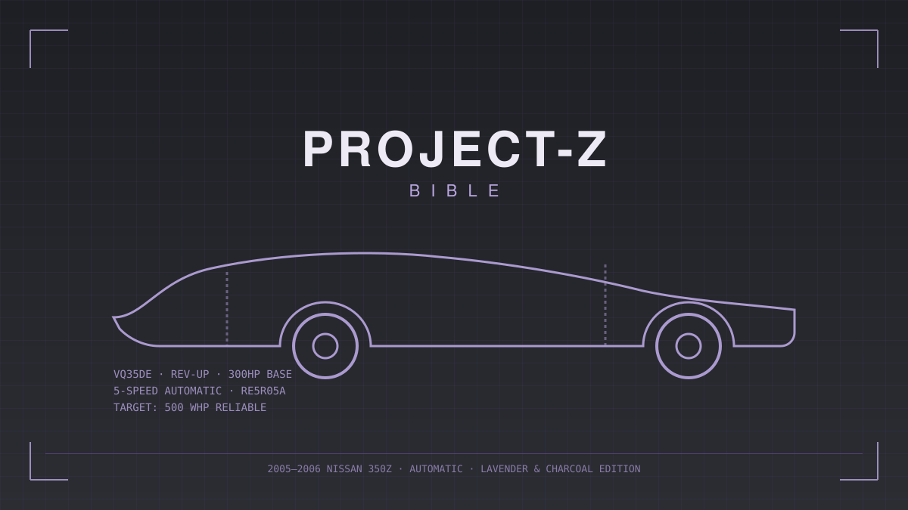

<!--
  Reusable cover page skeleton. chapters/00-cover.md is the version already filled in
  for this build — copy this file instead if you ever start a second Project-Z-Bible-style
  handbook for a different car and want the same layout.
-->

# TITLE

### Subtitle line

**One-line hook**

---

**Theme:** Lavender & Charcoal
**Budget Envelope:** $__,___ – $__,___
**Platform:** ______________________

---

*A living document. Print it, mark it up, update it every time a part goes on the car.*

**Edition:** v1.0
**Owner:** _____________________________
**VIN:** _____________________________
**Build Start Date:** _____________________________

