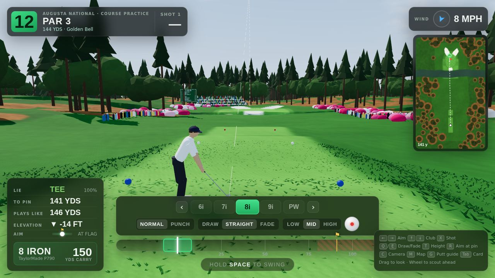
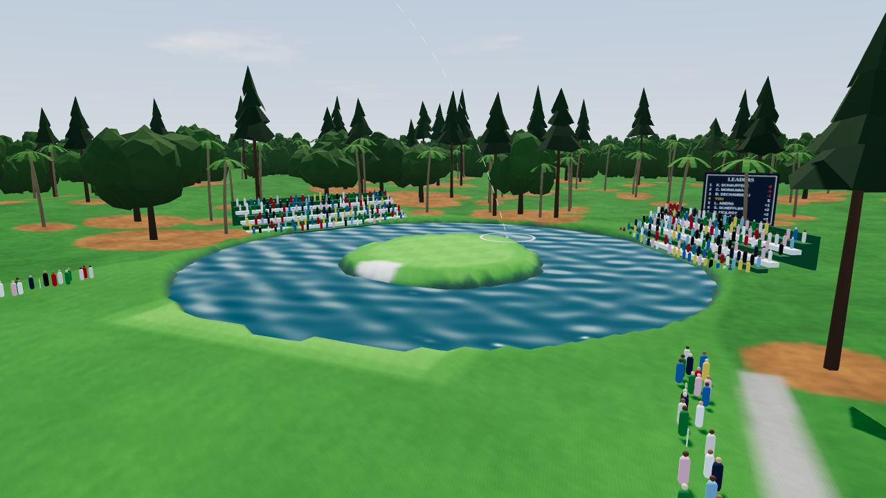
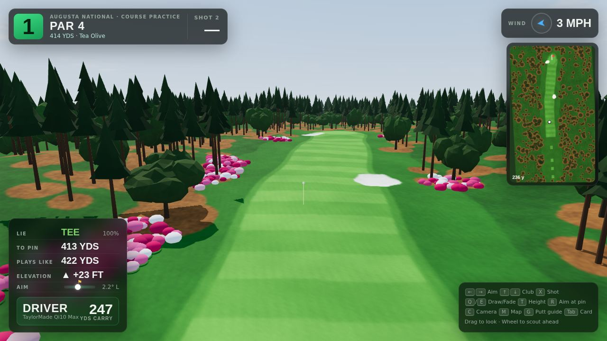
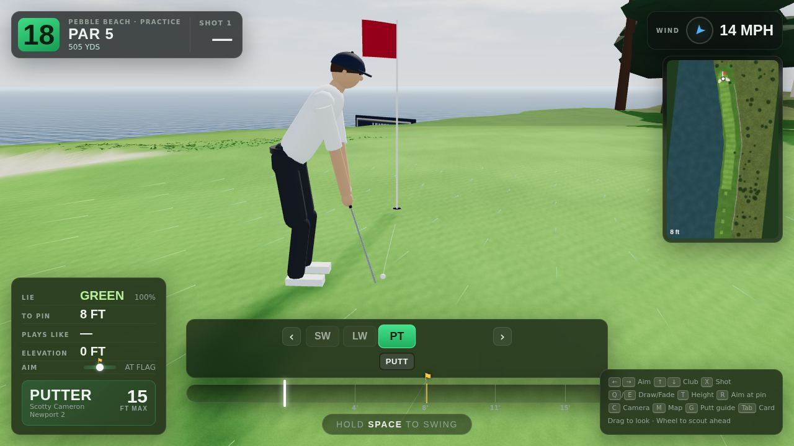
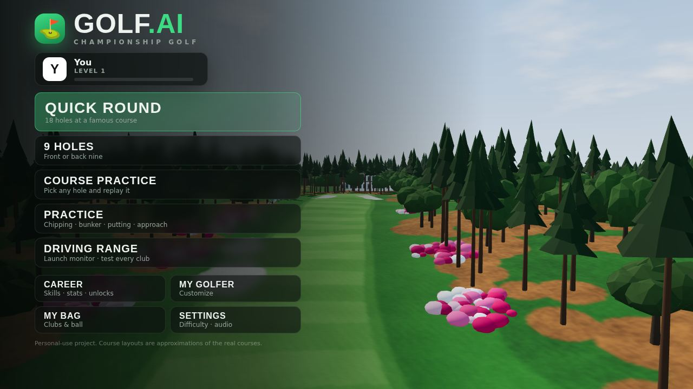

# Golf.ai Championship

A single-player 3D golf game that runs in the browser. Pick a golfer, grab your clubs, choose a famous course and play a full round.



| | |
| --- | --- |
|  |  |
|  |  |

> Personal-use project. Course layouts are recreations of the real courses: real hole order, pars, yardages, doglegs, elevation and signature hazards. They are not survey-accurate.

## Play it

The game ships prebuilt in `dist/game.js`, so there's nothing to install.

- **Easiest:** open `game/index.html` in Chrome, Edge, Firefox or Safari.
- **Local server:** some browsers restrict `file://` pages. If yours does, run this and open http://localhost:8080:
  ```bash
  cd game
  python3 -m http.server 8080
  ```

You need a WebGL-capable browser. Progress saves automatically in the browser's local storage.

### Develop

```bash
cd game
npm install
npm run dev        # rebuilds on change, serves on http://localhost:8080
npm run build      # production bundle -> dist/game.js
npm run test:holes # generates all 180 holes and sanity-checks tees/greens
npm run test:physics
```

## How to play

| Control | Action |
| --- | --- |
| **Hold Space** | Backswing: the power meter fills. Past 100% you overswing, which gives more distance but a smaller sweet spot. |
| **Release Space** | Starts the downswing. The marker races back toward the green sweet spot. |
| **Tap Space** | Strike. A tap in the green zone is a pure hit. Early pulls or hooks; late pushes or slices. Missing badly costs distance. |
| ← / → | Aim. Hold to accelerate. You can also click the minimap to aim. |
| ↑ / ↓ | Change club. On the green, this changes the putt length scale instead. |
| X | Shot type: Normal, Punch, Chip, Pitch, Lob, Flop or Bunker. Which ones are available depends on your lie. |
| Q / E | Draw / fade |
| T | Trajectory: low, mid or high |
| I J K L, or click the ball icon | Strike point. Hitting the top of the ball adds topspin, the bottom adds backspin, the sides add sidespin. |
| R | Aim straight at the pin |
| C / M | Cycle camera (shot, player, overhead map, green) / toggle the overhead map |
| Mouse drag / wheel | Look around / scout ahead along your aim line |
| G | Toggle the putting guide (break line and slope arrows) |
| Tab / Esc | Scorecard / pause menu |
| Space or Enter during flight | Fast-forward |

Putting uses a single press: hold to set power and release to stroke. The flag on the meter marks a flat-green estimate of the hole distance. Uphill putts, downhill putts and green speed are yours to judge. On Easy the marker already accounts for slope.

## Features

- **10 real courses, 180 holes:** Augusta National, Pebble Beach, TPC Sawgrass, Torrey Pines South, Bethpage Black, Pinehurst No. 2, St Andrews Old Course, Valhalla, Oakmont and Riviera. Each has its own look: trees (loblolly pines, Monterey cypress, palms, eucalyptus, gorse), grass colors, sky, wind, green speed, firmness, water and buildings. Signature holes include Amen Corner with Rae's Creek, Pebble's 7th and 18th along the ocean, the Sawgrass Island Green, Oakmont's Church Pews, Riviera's bunker in the middle of the 6th green, St Andrews' Road Hole, the Swilcan Bridge and the Valley of Sin, and Pinehurst's turtle-back greens.
- **Tees:** Championship, Tournament, Member and Forward.
- **Ball physics:** drag and Magnus lift from real ball speed, launch and spin, plus wind that strengthens with height. Balls bounce off sloped terrain and bite or roll out based on spin and surface. Rolling responds to green speed, slope, lie, firmness, water, sand, trees (leaves and trunks), the flagstick and lip-outs.
- **Golf bag:** 19 club types from real brands, including TaylorMade, Callaway, Titleist, Ping, Cobra, Mizuno, Srixon, Cleveland, Bettinardi, Scotty Cameron and Odyssey. Each club has its own carry, launch, spin, accuracy and forgiveness. You build your own 14-club bag and choose your ball.
- **Golfers:** customize your own golfer's name, gender, skin tone, hair, beard, hat, shirt style, pants, shoes, glove, accessories and build. You can also play as tour pros with their own ratings.
- **Game modes:** Quick Round (18 holes), 9 Holes, Course Practice (replay any hole), Practice drills (approach, chipping, bunker, putting, tee shots) and a Driving Range with launch-monitor data.
- **Career:** earn XP, level up, spend skill points on Driving, Approach, Short Game, Putting and Recovery (skills also improve a little each round), and unlock courses, equipment, balls and clothing.
- **Scoring and stats:** a full scorecard with out/in/total and birdie/bogey markers. Per-round and career stats include fairways, greens in regulation, putts, driving distance, longest drive and putt, sand saves, up-and-downs and scoring average.
- **Difficulty:**
  - **Easy:** big sweet spot, wind-adjusted landing marker, full putt preview, gimmes
  - **Normal**
  - **Hard:** aim line only
  - **Realistic:** no marker, tight window and real dispersion
- **Presentation:**
  - hole flyovers and broadcast cameras (launch, follow, landing, green)
  - shot tracer, swing animation and a putting slope grid
  - procedural audio: birds, gulls, surf, wind, crowd reactions, club strikes, the cup rattle and splashes

### Using real course photos on the course cards

Course cards show a live render of each course's signature hole. To use a real photo instead, add it to `assets/courses/` named by course id (`augusta`, `pebble`, `sawgrass`, `torrey`, `bethpage`, `pinehurst`, `standrews`, `valhalla`, `oakmont`, `riviera`), then list it in `assets/courses/photos.json`, e.g. `["augusta.jpg", "pebble.jpg"]`. The manifest is only read when the page is served over http.

## Code layout

```
src/
  data/       courses.js (hole layouts), clubs.js, golfers.js, themes.js (per-course look & lies)
  core/       holeGen.js (layout -> terrain/surfaces/hazards/trees), physics.js, noise.js, profile.js (save + progression)
  game/       play.js (round flow, swing meter, rules, scoring, stats), shots.js (shot types, launch model)
  render/     world.js (three.js scene), trees.js, decor.js, golfer.js (rig + swing), camera.js, sky.js, textures.js
  ui/         hud.js (in-round HUD & scorecard), menus.js (front-end screens)
  audio/      audio.js (WebAudio synthesis)
```

**Adding a course:** add an entry to `COURSES` in `src/data/courses.js`, using the hole vocabulary documented at the top of that file. Pick or add a theme in `src/data/themes.js`. The generator builds the terrain, hazards, trees and decorations automatically.
